# System Design

A complete, topic-by-topic guide to system design — from networking fundamentals to distributed data, architecture patterns, resilience, security, and interview preparation. Every major concept comes with a diagram.

> **Taking reference from:**
> - **[The System Design Primer](https://github.com/donnemartin/system-design-primer)** by Donne Martin — <https://github.com/donnemartin/system-design-primer>
> - [System Design Course](https://github.com/TuShArBhArDwA/System-Design) (based on Karan Pratap Singh's course)
>
> All content here is rewritten and reorganized as personal study notes. Full credit to the original authors.

---

## Table of Contents

### Chapter I — Fundamentals & Trade-offs
- [What is System Design?](#what-is-system-design)
- [Performance vs Scalability](#performance-vs-scalability)
- [Latency vs Throughput](#latency-vs-throughput)
- [Availability](#availability)
- [CAP Theorem](#cap-theorem)
- [PACELC Theorem](#pacelc-theorem)
- [Consistency Patterns](#consistency-patterns)
- [Availability Patterns](#availability-patterns)
- [ACID vs BASE](#acid-vs-base)

### Chapter II — Networking
- [IP Addresses](#ip-addresses)
- [OSI Model](#osi-model)
- [TCP vs UDP](#tcp-vs-udp)
- [Domain Name System (DNS)](#domain-name-system-dns)

### Chapter III — Traffic Management & Delivery
- [Load Balancing](#load-balancing)
- [Clustering](#clustering)
- [Proxies (Forward & Reverse)](#proxies-forward--reverse)
- [API Gateway](#api-gateway)
- [Content Delivery Network (CDN)](#content-delivery-network-cdn)

### Chapter IV — Caching
- [Caching](#caching)
- [Cache Writing Strategies](#cache-writing-strategies)
- [Eviction Policies](#eviction-policies)
- [Distributed Caching](#distributed-caching)

### Chapter V — Databases
- [Types of Databases](#types-of-databases)
- [SQL vs NoSQL](#sql-vs-nosql)
- [Database Replication](#database-replication)
- [Indexes](#indexes)
- [Normalization & Denormalization](#normalization--denormalization)
- [Transactions](#transactions)
- [Distributed Transactions](#distributed-transactions)
- [Sharding & Partitioning](#sharding--partitioning)
- [Consistent Hashing](#consistent-hashing)
- [Database Federation](#database-federation)
- [ID Generation Strategies](#id-generation-strategies)

### Chapter VI — Architecture Patterns
- [N-tier Architecture](#n-tier-architecture)
- [Monoliths vs Microservices](#monoliths-vs-microservices)
- [Service Discovery](#service-discovery)
- [Asynchronism: Message Queues & Task Queues](#asynchronism-message-queues--task-queues)
- [Message Brokers: Queues vs Publish-Subscribe](#message-brokers-queues-vs-publish-subscribe)
- [Message Queue Guarantees](#message-queue-guarantees)
- [Event-Driven Architecture (EDA)](#event-driven-architecture-eda)
- [Event Sourcing](#event-sourcing)
- [CQRS](#cqrs)

### Chapter VII — Communication & APIs
- [REST vs GraphQL vs gRPC](#rest-vs-graphql-vs-grpc)
- [Remote Procedure Call (RPC)](#remote-procedure-call-rpc)
- [Long Polling vs WebSockets vs Server-Sent Events](#long-polling-vs-websockets-vs-server-sent-events)

### Chapter VIII — Reliability & Operations
- [Circuit Breaker](#circuit-breaker)
- [Rate Limiting](#rate-limiting)
- [SLA, SLO, SLI](#sla-slo-sli)
- [Disaster Recovery](#disaster-recovery)
- [Virtual Machines & Containers](#virtual-machines--containers)

### Chapter IX — Security
- [OAuth 2.0 & OpenID Connect](#oauth-20--openid-connect)
- [Single Sign-On (SSO)](#single-sign-on-sso)
- [SSL, TLS, mTLS](#ssl-tls-mtls)

### Chapter X — Interview Preparation
- [How to Approach a System Design Interview](#how-to-approach-a-system-design-interview)
- [Back-of-the-Envelope Calculations](#back-of-the-envelope-calculations)
- [Geohashing & Quadtrees](#geohashing--quadtrees)
- [Design: URL Shortener](#design-url-shortener-easy)
- [Design: WhatsApp](#design-whatsapp-medium)
- [Design: Twitter](#design-twitter-medium)
- [Design: Netflix](#design-netflix-hard)
- [Design: Uber](#design-uber-hard)
- [Design: Web Crawler](#design-web-crawler-medium)
- [Design: Rate Limiter](#design-rate-limiter-easy)
- [Design: Notification System](#design-notification-system-medium)
- [Design: Search Autocomplete](#design-search-autocomplete-medium)
- [Design: Unique ID Generator](#design-unique-id-generator-easy)
- [Design Problems Quick Reference](#design-problems-quick-reference)
- [Real-World Architectures](#real-world-architectures)
- [References](#references)
- [Company Engineering Blogs](#company-engineering-blogs)

---

# Chapter I — Fundamentals & Trade-offs

## What is System Design?

System design is the process of defining the architecture, interfaces, and data for a system that satisfies specific business requirements. It is about making reasoned trade-offs: no design is "correct," only appropriate for a given scale, budget, and set of constraints.

A typical large-scale web system evolves from a single server into something like this:

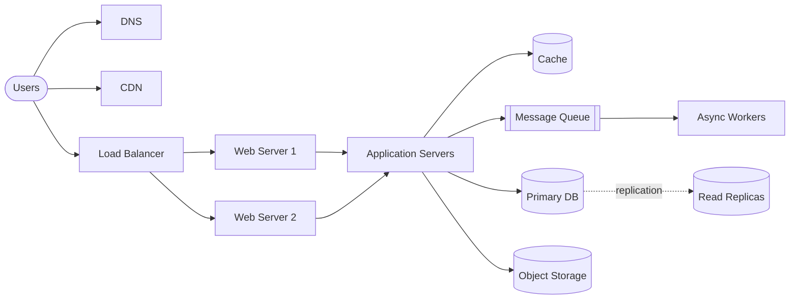

**Why it matters:** decisions about databases, caching, communication, and failure handling are very hard to reverse later. Understanding the building blocks in this guide lets you compose them deliberately instead of accidentally.

**Source(s) and further reading**

- [The System Design Primer](https://github.com/donnemartin/system-design-primer)
- [System Design course — Karan Pratap Singh](https://www.karanpratapsingh.com/courses/system-design)
- [Scalability Lecture at Harvard (CS75)](https://www.youtube.com/watch?v=-W9F__D3oY4)

## Performance vs Scalability

- A service is **performant** if it is fast for a single user.
- A service is **scalable** if performance stays acceptable as load or dataset size grows proportionally to the resources added.

Put simply:

- **Performance problem** → the system is slow for *one* user.
- **Scalability problem** → the system is fast for one user but slow *under heavy load*.

Two ways to scale:

| | Vertical scaling (scale up) | Horizontal scaling (scale out) |
|---|---|---|
| How | Bigger machine (more CPU/RAM) | More machines |
| Limit | Hardware ceiling, single point of failure | Nearly unlimited |
| Complexity | Low | High (load balancing, data distribution) |
| Cost curve | Exponential at the high end | Linear, commodity hardware |

**Source(s) and further reading**

- [A Word on Scalability — Werner Vogels](https://www.allthingsdistributed.com/2006/03/a_word_on_scalability.html)
- [Scalability, Availability, Stability, Patterns — Jonas Bonér](https://www.slideshare.net/jboner/scalability-availability-stability-patterns)

## Latency vs Throughput

- **Latency** — time to perform a single action (e.g., one request takes 100 ms).
- **Throughput** — number of actions per unit of time (e.g., 10,000 requests/second).

They are related but independent: batching improves throughput while *increasing* latency; adding servers can improve throughput without changing per-request latency.

> **Goal:** maximal throughput with *acceptable* latency — not minimal latency at all costs.

**Source(s) and further reading**

- [Understanding Latency vs Throughput — Cadence](https://community.cadence.com/cadence_blogs_8/b/fv/posts/understanding-latency-vs-throughput)
- [The Difference Between Throughput and Latency — AWS](https://aws.amazon.com/compare/the-difference-between-throughput-and-latency/)

## Availability

Availability is the percentage of time a system is operational. It is usually expressed in "nines":

| Availability | Downtime/year | Downtime/month | Downtime/day |
|---|---|---|---|
| 90% (one nine) | 36.53 days | 72 hours | 2.4 hours |
| 99% (two nines) | 3.65 days | 7.3 hours | 14.4 minutes |
| 99.9% (three nines) | 8.77 hours | 43.8 minutes | 1.44 minutes |
| 99.99% (four nines) | 52.6 minutes | 4.38 minutes | 8.64 seconds |
| 99.999% (five nines) | 5.26 minutes | 26.3 seconds | 864 ms |

**Availability in sequence vs parallel:**

- Components **in sequence** multiply: two 99.9% services in sequence → `99.9% × 99.9% = 99.8%` (worse).
- Components **in parallel** (redundant): `1 − (0.001 × 0.001) = 99.9999%` (better).

This is why redundancy is the fundamental tool for high availability.

**Source(s) and further reading**

- [AWS Well-Architected Framework — Reliability Pillar](https://docs.aws.amazon.com/wellarchitected/latest/reliability-pillar/welcome.html)
- [Uptime/downtime calculator](https://uptime.is/)
- [Static stability using Availability Zones — AWS Builders' Library](https://aws.amazon.com/builders-library/static-stability-using-availability-zones/)

## CAP Theorem

In a distributed system, when a **network partition** occurs, you must choose between **consistency** and **availability**. You cannot have both.

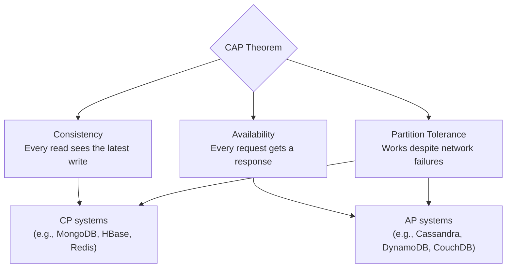

- **CP (Consistency + Partition tolerance)** — during a partition, refuse some requests rather than serve stale data. Good when your business needs atomic reads/writes (banking, inventory).
- **AP (Availability + Partition tolerance)** — during a partition, keep serving possibly-stale data and reconcile later. Good when the business tolerates eventual consistency (social feeds, analytics).
- **CA** does not really exist in distributed systems — networks *will* partition, so partition tolerance is mandatory.

**Source(s) and further reading**

- [A Plain English Introduction to CAP Theorem](http://ksat.me/a-plain-english-introduction-to-cap-theorem)
- [CAP Theorem Revisited — Robert Greiner](https://robertgreiner.com/cap-theorem-revisited/)
- [CAP Twelve Years Later: How the "Rules" Have Changed — Eric Brewer](https://www.infoq.com/articles/cap-twelve-years-later-how-the-rules-have-changed/)

## PACELC Theorem

CAP only describes behavior *during* a partition. PACELC extends it: **if Partition (P), choose Availability or Consistency (AC); Else (E), choose Latency or Consistency (LC)**.

Even when the network is healthy, replicating data forces a choice: wait for all replicas to confirm (consistency, higher latency) or respond immediately (lower latency, weaker consistency).

| System | During partition | Otherwise |
|---|---|---|
| DynamoDB, Cassandra | A | L |
| MongoDB | C | L |
| Spanner, VoltDB | C | C |

**Source(s) and further reading**

- [PACELC theorem — Wikipedia](https://en.wikipedia.org/wiki/PACELC_theorem)
- [Consistency Tradeoffs in Modern Distributed Database System Design — Daniel Abadi](https://www.cs.umd.edu/~abadi/papers/abadi-pacelc.pdf)

## Consistency Patterns

With multiple copies of the same data, how do clients see updates?

1. **Weak consistency** — after a write, reads may or may not see it. Best effort. Used in real-time media (VoIP, video calls, games) where missing a moment is acceptable.
2. **Eventual consistency** — after a write, reads will see it after some delay (typically milliseconds). Data spreads asynchronously. Used by DNS, email, and most AP databases. Works well for highly available systems.
3. **Strong consistency** — after a write, every read sees it immediately. Data is replicated synchronously. Used by file systems, RDBMSs, and anything needing transactions.

**Source(s) and further reading**

- [Consistency Models — Jepsen](https://jepsen.io/consistency)
- [Transactions Across Datacenters — Google I/O talk](https://snarfed.org/transactions_across_datacenters_io.html)

## Availability Patterns

### Failover

- **Active-passive** — heartbeats run between an active and a standby server. If the heartbeat stops, the standby takes over the active's IP address. Downtime equals detection + promotion time.
- **Active-active** — all servers handle traffic simultaneously, spreading load. If one dies, the rest absorb its traffic.

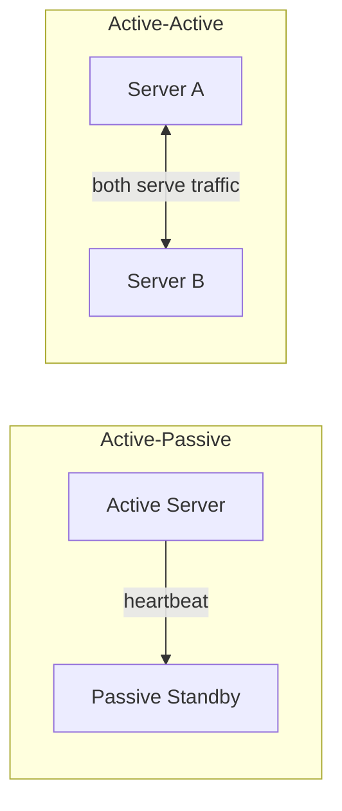

**Disadvantages of failover:** more hardware, and potential data loss if the active fails before newly written data replicates to the standby.

### Replication

Copies of data on multiple nodes — covered in depth in [Database Replication](#database-replication).

**Source(s) and further reading**

- [Failover — Wikipedia](https://en.wikipedia.org/wiki/Failover)
- [Active-Active for Multi-Regional Resiliency — Netflix Tech Blog](https://netflixtechblog.com/active-active-for-multi-regional-resiliency-c47719f6685b)

## ACID vs BASE

Two consistency philosophies for databases:

**ACID** (relational transactions):
- **Atomicity** — a transaction fully happens or doesn't happen at all.
- **Consistency** — a transaction moves the DB from one valid state to another.
- **Isolation** — concurrent transactions behave as if executed sequentially.
- **Durability** — committed data survives crashes.

**BASE** (many NoSQL systems):
- **Basically Available** — the system guarantees availability.
- **Soft state** — state may change over time even without input (due to propagation).
- **Eventual consistency** — the system converges to a consistent state given time.

> Rule of thumb: ACID = correctness first (money, orders, inventory). BASE = availability and scale first (feeds, likes, metrics).

**Source(s) and further reading**

- [ACID — Wikipedia](https://en.wikipedia.org/wiki/ACID)
- [The Difference Between ACID and BASE — AWS](https://aws.amazon.com/compare/the-difference-between-acid-and-base-database/)

---

# Chapter II — Networking

## IP Addresses

An IP address is a unique identifier for a device on a network.

**Versions:**
- **IPv4** — 32-bit, dotted decimal (`102.22.192.181`), ~4.3 billion addresses (exhausted).
- **IPv6** — 128-bit, hexadecimal groups (`2001:0db8:85a3::8a2e:0370:7334`), ~340 undecillion addresses.

**Types:**
- **Public** — one primary address for a whole network, visible to the internet (e.g., your router's address).
- **Private** — unique within a private network (each device at home/office).
- **Static** — manually assigned, doesn't change; used for servers and DNS reliability.
- **Dynamic** — assigned by DHCP, changes over time; typical for consumer devices.

**Source(s) and further reading**

- [What is my IP address? — Cloudflare Learning Center](https://www.cloudflare.com/learning/dns/glossary/what-is-my-ip-address/)
- [IPv6 — Wikipedia](https://en.wikipedia.org/wiki/IPv6)

## OSI Model

The OSI model splits network communication into seven layers, each depending on the one below it. It gives us a shared vocabulary for troubleshooting and designing protocols.

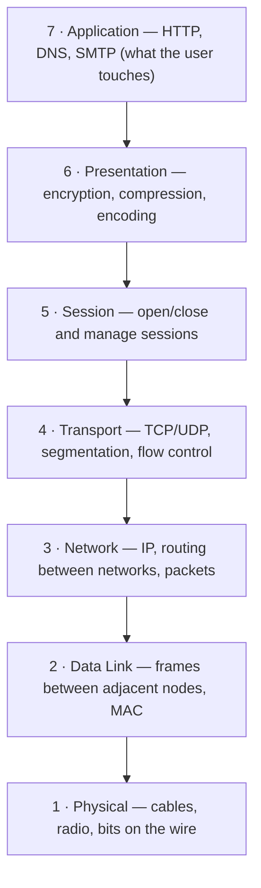

**Why it matters for system design:** load balancers are described by the layer they operate on (L4 vs L7), and understanding where TLS, TCP, and HTTP live explains what each infrastructure component can and cannot see.

**Source(s) and further reading**

- [What is the OSI Model? — Cloudflare Learning Center](https://www.cloudflare.com/learning/ddos/glossary/open-systems-interconnection-model-osi/)
- [OSI model — Wikipedia](https://en.wikipedia.org/wiki/OSI_model)

## TCP vs UDP

**TCP** is connection-oriented: it establishes a connection with a three-way handshake, numbers every byte, acknowledges receipt, retransmits losses, and delivers data in order.

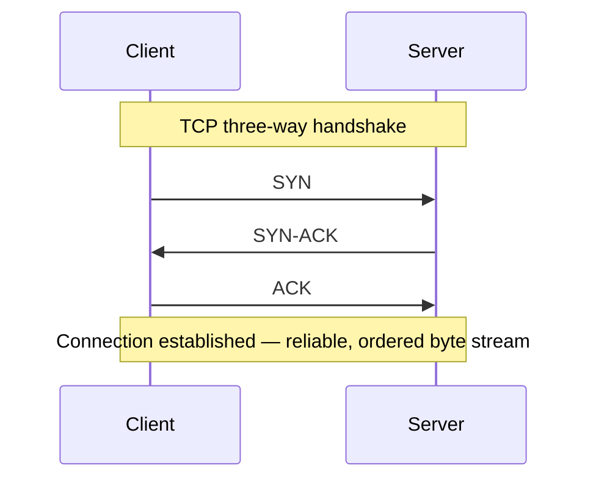

**UDP** is connectionless: no handshake, no acknowledgment, no ordering, no retransmission. Packets ("datagrams") may arrive out of order or not at all — but there is far less overhead and latency.

| | TCP | UDP |
|---|---|---|
| Connection | Required (handshake) | None |
| Delivery guarantee | Guaranteed, ordered | Best effort |
| Speed | Slower (overhead) | Faster |
| Use cases | HTTP/HTTPS, email, file transfer | Video streaming, VoIP, gaming, DNS lookups |

> Rule of thumb: use **TCP** when you cannot afford to lose data; use **UDP** when speed matters more than completeness (a lost video frame is better dropped than replayed late).

**Source(s) and further reading**

- [What is TCP/IP? — Cloudflare Learning Center](https://www.cloudflare.com/learning/ddos/glossary/tcp-ip/)
- [What is UDP? — Cloudflare Learning Center](https://www.cloudflare.com/learning/ddos/glossary/user-datagram-protocol-udp/)
- [UDP vs TCP — Gaffer On Games](https://gafferongames.com/post/udp_vs_tcp/)

## Domain Name System (DNS)

DNS is the phonebook of the internet: it translates human-friendly names (`example.com`) into IP addresses.

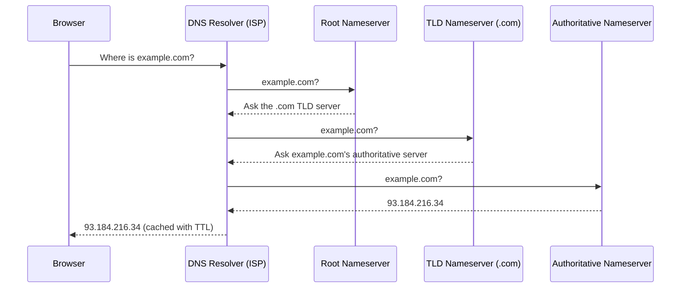

**Server types:**
- **DNS Resolver** — first stop; middleman between you and the hierarchy, caches results.
- **Root nameserver** — directs the resolver to the right TLD server (13 logical root servers worldwide).
- **TLD nameserver** — handles a top-level domain like `.com` or `.org`.
- **Authoritative nameserver** — holds the actual records for the domain; the final answer.

**Query types:** *recursive* (resolver must return an answer or error), *iterative* (server returns a referral to try next), *non-recursive* (answer already cached).

**Common record types:**

| Record | Purpose |
|---|---|
| A / AAAA | Name → IPv4 / IPv6 address |
| CNAME | Alias of one name to another |
| MX | Mail server for the domain |
| TXT | Arbitrary text (often domain verification, SPF/DKIM) |
| NS | Delegates the zone to nameservers |

**Caching & TTL:** every record carries a TTL; browsers, operating systems, and resolvers all cache to reduce lookups. This is also why DNS changes take time to propagate.

**Managed providers:** Route53, Cloudflare DNS, Google Cloud DNS, Azure DNS.

**Source(s) and further reading**

- [What is DNS? — Cloudflare Learning Center](https://www.cloudflare.com/learning/dns/what-is-dns/)
- [How DNS works — comic explainer](https://howdns.works/)
- [RFC 1035 — Domain Names: Implementation and Specification](https://datatracker.ietf.org/doc/html/rfc1035)

---

# Chapter III — Traffic Management & Delivery

## Load Balancing

A load balancer distributes incoming traffic across multiple servers, preventing any single server from becoming a bottleneck or single point of failure.

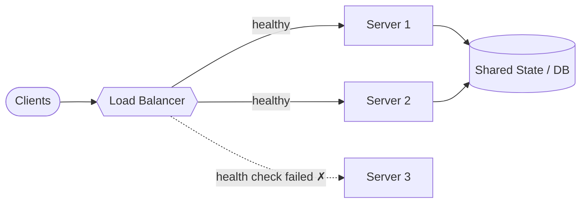

**Where it can sit:** between users and web servers, web servers and app servers, and app servers and databases.

**Layer 4 vs Layer 7:**

| | L4 (Transport) | L7 (Application) |
|---|---|---|
| Sees | IPs and ports only | Full request: headers, cookies, URL |
| Routing | NAT-style forwarding | Content-based (e.g., `/video` → video servers) |
| Speed | Faster, less CPU | Slightly slower, far more flexible |

**Routing algorithms:**
- **Round robin** — cycle through servers in order (simplest).
- **Weighted round robin** — heavier servers receive more requests.
- **Least connections** — send to the server with the fewest active connections.
- **Least response time** — combine connection count and latency.
- **IP hash / sticky sessions** — same client lands on the same server (needed when session state lives on the server).

**Health checks:** the balancer regularly probes backends and removes failing ones from the pool until they recover.

**Redundant load balancers:** the balancer itself must not be a single point of failure — run a pair (active-passive or active-active, often with a floating IP).

**Disadvantages:** a bottleneck if under-resourced; adds configuration complexity; single balancer = new single point of failure.

**Examples:** AWS ELB/ALB, NGINX, HAProxy, Traefik, Cloudflare Load Balancing.

**Source(s) and further reading**

- [What is Load Balancing? — NGINX](https://www.nginx.com/resources/glossary/load-balancing/)
- [Introduction to Modern Network Load Balancing and Proxying — Matt Klein](https://blog.envoyproxy.io/introduction-to-modern-network-load-balancing-and-proxying-a57f6ff80236)
- [What is Load Balancing? — AWS](https://aws.amazon.com/what-is/load-balancing/)

## Clustering

A cluster is a group of machines working together as one logical unit, coordinated to perform a task.

- **Active-active** — all nodes serve traffic simultaneously (throughput + availability).
- **Active-passive** — standby nodes take over on failure (availability only).

**Load balancing vs clustering:** clustered nodes *know about each other* and cooperate toward a shared purpose; load-balanced servers are typically unaware of each other and simply share incoming work. The two are frequently combined.

**Challenges:** keeping state consistent across nodes, split-brain scenarios, and the added complexity of deployment and monitoring.

**Examples:** Kubernetes node pools, Redis Cluster, Kafka brokers, PostgreSQL HA clusters.

**Source(s) and further reading**

- [Computer cluster — Wikipedia](https://en.wikipedia.org/wiki/Computer_cluster)
- [Scale with Redis Cluster — Redis docs](https://redis.io/docs/latest/operate/oss_and_stack/management/scaling/)

## Proxies (Forward & Reverse)

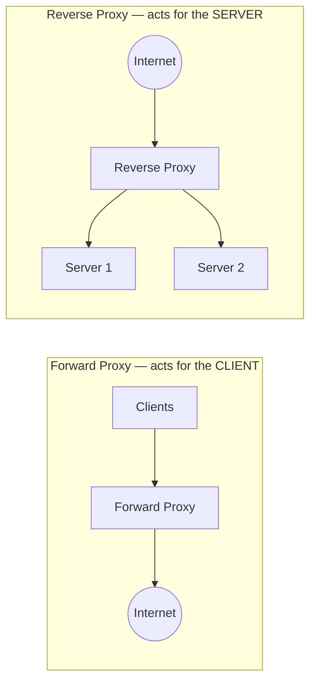

**Forward proxy** sits in front of clients: hides client identity, enforces corporate policies, bypasses restrictions, caches outbound requests. The server only sees the proxy.

**Reverse proxy** sits in front of servers: hides the backend topology, terminates TLS, caches responses, compresses, rate-limits, and routes. The client only sees the proxy.

**Load balancer vs reverse proxy:** a load balancer is useful when you have *multiple* servers; a reverse proxy is useful even with *one* server (security, TLS, caching). In practice, tools like NGINX and HAProxy do both.

**Examples:** NGINX, HAProxy, Envoy, Cloudflare.

**Source(s) and further reading**

- [What is a Reverse Proxy? — Cloudflare Learning Center](https://www.cloudflare.com/learning/cdn/glossary/reverse-proxy/)
- [NGINX Reverse Proxy — admin guide](https://docs.nginx.com/nginx/admin-guide/web-server/reverse-proxy/)
- [Proxy server — Wikipedia](https://en.wikipedia.org/wiki/Proxy_server)

## API Gateway

An API gateway is a reverse proxy specialized for APIs — a single entry point that fronts many backend services.

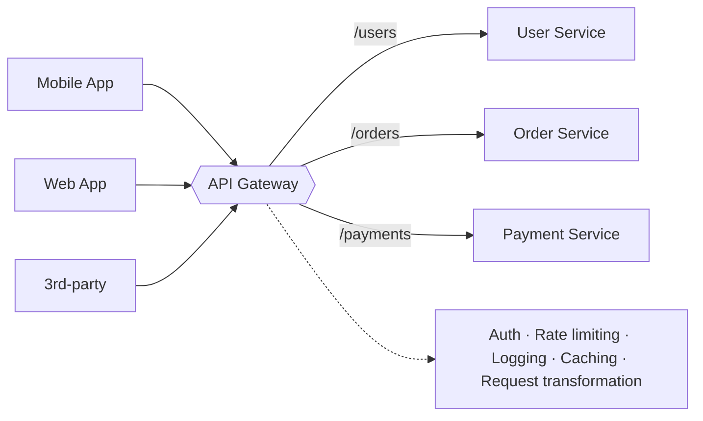

**Responsibilities:** authentication/authorization, rate limiting, request routing, protocol translation (e.g., REST outside, gRPC inside), response aggregation, monitoring, and versioning.

**Trade-off:** one more hop of latency and a critical component to keep highly available — but without it, every microservice must re-implement these cross-cutting concerns.

**Examples:** Amazon API Gateway, Kong, Apigee, Zuul.

**Source(s) and further reading**

- [API Gateway pattern — microservices.io](https://microservices.io/patterns/apigateway.html)
- [Building Microservices: Using an API Gateway — NGINX](https://www.nginx.com/blog/building-microservices-using-an-api-gateway/)
- [Amazon API Gateway](https://aws.amazon.com/api-gateway/)

## Content Delivery Network (CDN)

A CDN is a geographically distributed network of servers that delivers content from locations close to each user, cutting latency dramatically.

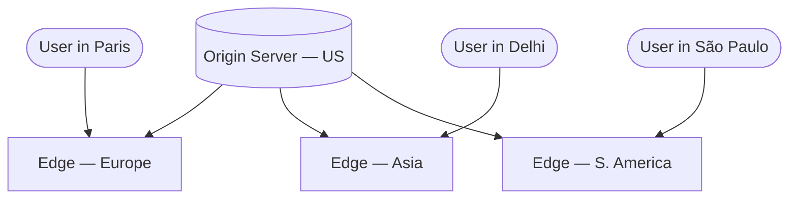

**Push CDN** — you upload content to the CDN whenever it changes. Full control, good for sites with little or rarely-changing content; wasteful if content changes often.

**Pull CDN** — the CDN fetches from your origin on the first request ("cache miss") and serves from cache afterward, per TTL. Less maintenance, ideal for heavy traffic; first requests are slow and content may be re-pulled before it actually changed.

**Disadvantages:** cost, stale content if TTLs are mismanaged, and URLs pointing at the CDN break if you disable it.

**Examples:** Cloudflare, CloudFront, Fastly, Akamai.

**Source(s) and further reading**

- [What is a CDN? — Cloudflare Learning Center](https://www.cloudflare.com/learning/cdn/what-is-a-cdn/)
- [Content delivery network — Wikipedia](https://en.wikipedia.org/wiki/Content_delivery_network)
- [Amazon CloudFront features](https://aws.amazon.com/cloudfront/features/)

---

# Chapter IV — Caching

## Caching

A cache is a fast, short-term storage layer that serves future requests for the same data faster than the primary store. Caching exploits the **locality principle**: recently requested data is likely to be requested again.

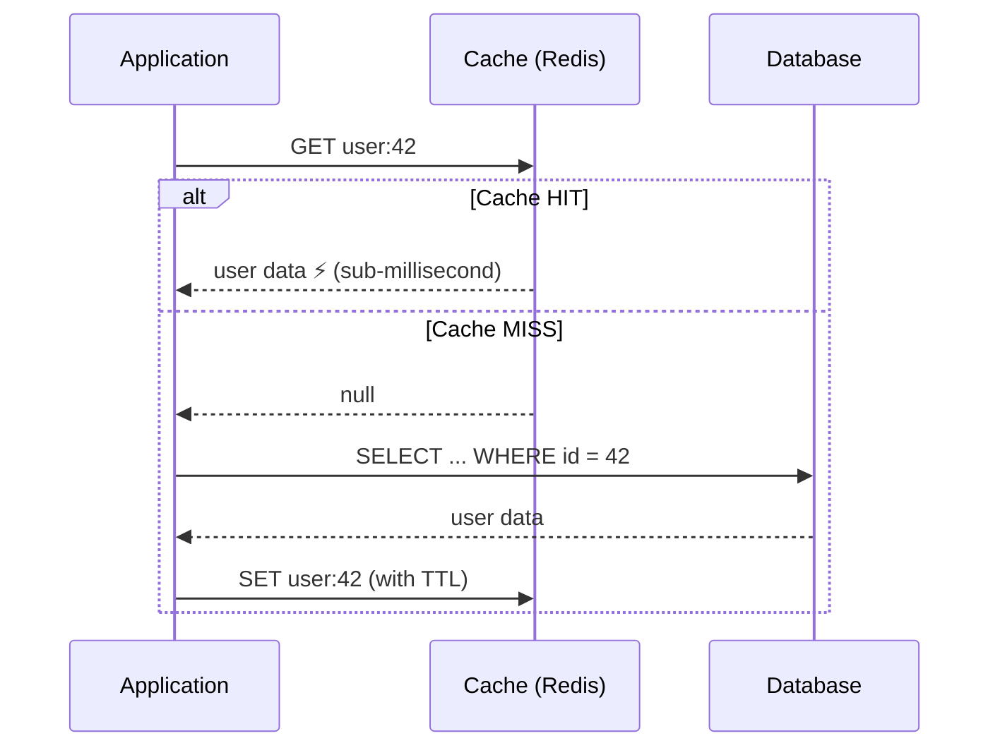

- **Cache hit** — data found in cache. Fast path.
- **Cache miss** — not found; fetch from origin, then populate the cache.

**Where caching happens at every level:** client/browser → CDN → web server → application → database (query cache and object cache) → hardware (CPU L1/L2/L3).

**Cache invalidation** is one of the two famously hard problems in computer science. Stale data is the price of speed — TTLs, explicit invalidation on writes, and versioned keys are the standard tools.

**Source(s) and further reading**

- [Caching Overview — AWS](https://aws.amazon.com/caching/)
- [Introduction to Architecting Systems for Scale — Will Larson](https://lethain.com/introduction-to-architecting-systems-for-scale/)
- [Redis documentation](https://redis.io/docs/latest/)

## Cache Writing Strategies

| Strategy | How it works | Pros | Cons |
|---|---|---|---|
| **Cache-aside (lazy)** | App reads cache first; on miss reads DB and fills cache | Only requested data is cached; cache failure isn't fatal | First request always misses; data can go stale |
| **Write-through** | App writes to cache, cache synchronously writes to DB | Cache always fresh; reads fast | Every write pays double latency; cold cache on restart |
| **Write-behind (write-back)** | App writes to cache; cache flushes to DB asynchronously | Fastest writes; absorbs write bursts | Data loss if cache dies before flush |
| **Write-around** | Writes go straight to DB; only reads populate cache | Cache not flooded by write-heavy data | Recently written data always misses |
| **Refresh-ahead** | Cache proactively refreshes hot entries before expiry | Low latency for predictable access | Wasted work if predictions are wrong |

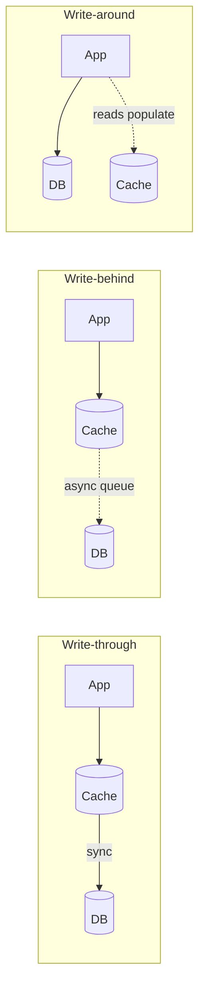

**Source(s) and further reading**

- [Database Caching Strategies Using Redis — AWS whitepaper](https://docs.aws.amazon.com/whitepapers/latest/database-caching-strategies-using-redis/welcome.html)
- [Caching Strategies and How to Choose the Right One — CodeAhoy](https://codeahoy.com/2017/08/11/caching-strategies-and-how-to-choose-the-right-one/)
- [Scaling Memcache at Facebook — USENIX paper](https://www.usenix.org/system/files/conference/nsdi13/nsdi13-final170_update.pdf)

## Eviction Policies

When the cache is full, something must go:

- **LRU** — evict the *least recently used* entry (the most common default).
- **LFU** — evict the *least frequently used*.
- **FIFO / LIFO** — evict by insertion order.
- **RR** — evict a random entry.
- **TTL-based** — entries expire after a fixed lifetime regardless of use.

**Source(s) and further reading**

- [Cache replacement policies — Wikipedia](https://en.wikipedia.org/wiki/Cache_replacement_policies)
- [Key eviction — Redis docs](https://redis.io/docs/latest/develop/reference/eviction/)

## Distributed Caching

A single cache node hits memory limits; a **distributed cache** pools memory across machines, usually sharding keys via [consistent hashing](#consistent-hashing) so nodes can join/leave with minimal disruption. A **global cache** is a single shared cache space all nodes use — simpler, but a scalability and failure bottleneck.

**Use cases:** database query results, session storage, rendered pages/fragments, API responses, counters and rate-limit state.

**Examples:** Redis, Memcached, Hazelcast, Amazon ElastiCache.

**Source(s) and further reading**

- [Memcached wiki](https://github.com/memcached/memcached/wiki)
- [Amazon ElastiCache](https://aws.amazon.com/elasticache/)
- [Consistent hashing (how distributed caches shard keys)](#consistent-hashing)

---

# Chapter V — Databases

## Types of Databases

**SQL (relational)** — data in tables with rows and columns, rigid schemas, powerful joins, ACID transactions. *MySQL, PostgreSQL, Oracle, SQL Server.*

**NoSQL families:**

| Family | Model | Great for | Examples |
|---|---|---|---|
| Key-value | `key → value`, hash-table semantics | Sessions, caching, feature flags | Redis, DynamoDB, Memcached |
| Document | JSON-like documents, flexible schema | Product catalogs, user profiles, CMS | MongoDB, CouchDB, Firestore |
| Wide-column | Rows with dynamic columns, partitioned | Time-series at scale, write-heavy loads | Cassandra, HBase, Bigtable |
| Graph | Nodes + edges, relationships first-class | Social graphs, recommendations, fraud detection | Neo4j, Neptune |
| Time-series | Timestamped points, optimized appends | Metrics, IoT telemetry | InfluxDB, TimescaleDB |
| Search | Inverted indexes | Full-text search, log analytics | Elasticsearch, Solr |

**Source(s) and further reading**

- [DB-Engines ranking](https://db-engines.com/en/ranking)
- [What is a Database? — AWS](https://aws.amazon.com/what-is/database/)
- [NoSQL Databases Explained — MongoDB](https://www.mongodb.com/resources/basics/databases/nosql-explained)

## SQL vs NoSQL

| Dimension | SQL | NoSQL |
|---|---|---|
| Schema | Fixed, enforced up front | Dynamic, per-record flexibility |
| Scaling | Traditionally vertical (replicas/sharding possible but manual) | Designed for horizontal scale-out |
| Transactions | Strong ACID | Usually BASE / eventual consistency |
| Queries | Rich SQL, joins | Simple lookups; joins done in app code |
| Consistency | Strong | Often tunable (eventual → strong) |

**Reasons to pick SQL:** structured relational data, transactional correctness (money!), complex queries, mature tooling.

**Reasons to pick NoSQL:** semi-structured or rapidly evolving data, massive write throughput, geographic distribution, storing terabytes where joins are rare and access patterns are known.

> Real systems mix both: an RDBMS as the source of truth, Redis for caching, Elasticsearch for search, and a wide-column store for analytics is a completely normal stack.

**Source(s) and further reading**

- [SQL or NoSQL — The System Design Primer](https://github.com/donnemartin/system-design-primer#sql-or-nosql)
- [NoSQL — Wikipedia](https://en.wikipedia.org/wiki/NoSQL)

## Database Replication

Replication keeps copies of the same data on multiple nodes for **availability**, **read scaling**, and **durability**.

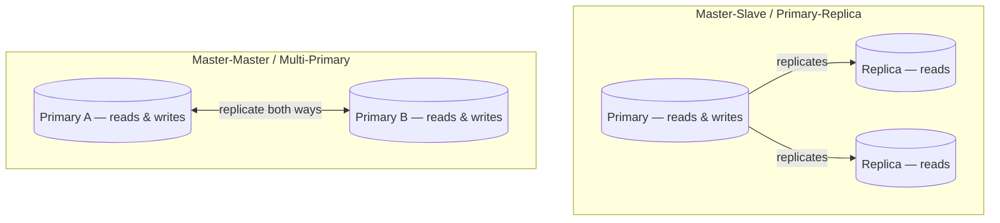

**Master-slave (primary-replica):** one node takes all writes; replicas serve reads. If the primary dies, a replica is promoted. Simple and very common. *Downside:* promotion takes time, and writes are limited to one node.

**Master-master (multi-primary):** every node accepts writes and syncs with the others. Better write availability. *Downsides:* conflict resolution, looser consistency or higher write latency, and much trickier operations (e.g., ID generation must avoid collisions).

**Synchronous vs asynchronous replication:** synchronous waits for replicas to confirm (no data loss, higher latency — the PACELC trade-off); asynchronous responds immediately (fast, but a crash can lose the latest writes).

**Replication lag:** async replicas trail the primary; reading your own just-written data from a replica may return stale results ("read-your-writes" problems).

**Source(s) and further reading**

- [High Availability, Load Balancing, and Replication — PostgreSQL docs](https://www.postgresql.org/docs/current/high-availability.html)
- [Replication — MySQL docs](https://dev.mysql.com/doc/refman/8.0/en/replication.html)
- [Designing Data-Intensive Applications, ch. 5 (Replication) — Martin Kleppmann](https://dataintensive.net/)

## Indexes

An index is a data structure (typically a B-tree) that trades extra storage and slower writes for dramatically faster reads — like a book's index versus scanning every page.

- Point the index at the columns your `WHERE`, `JOIN`, and `ORDER BY` clauses actually use.
- **Composite indexes** cover multi-column queries; column order matters.
- Every index must be updated on `INSERT`/`UPDATE`/`DELETE` — over-indexing makes writes crawl.
- A query served *entirely* from an index (a "covering index") never touches the table.

> Design habit: write the query first, then design the index for it — not the other way around.

**Source(s) and further reading**

- [Use the Index, Luke — SQL indexing and tuning](https://use-the-index-luke.com/)
- [Indexes — PostgreSQL docs](https://www.postgresql.org/docs/current/indexes.html)

## Normalization & Denormalization

**Normalization** removes redundancy by splitting data into well-factored tables (1NF → 2NF → 3NF …). One fact lives in one place; updates are safe and storage is minimal. The cost: reads need joins, and joins get expensive at scale.

**Denormalization** deliberately duplicates data to eliminate joins and make reads fast. The cost: more storage, and every duplicated fact must be kept in sync on writes.

| | Normalized | Denormalized |
|---|---|---|
| Optimized for | Writes, integrity | Reads, speed |
| Redundancy | None | Intentional |
| Risk | Slow joins at scale | Inconsistent copies |

> Typical evolution: start normalized; denormalize *specific hot paths* once measurements prove joins are the bottleneck. Once data is sharded or federated, cross-node joins become so expensive that denormalization is nearly mandatory.

**Source(s) and further reading**

- [Database normalization — Wikipedia](https://en.wikipedia.org/wiki/Database_normalization)
- [Description of the database normalization basics — Microsoft](https://learn.microsoft.com/en-us/office/troubleshoot/access/database-normalization-description)

## Transactions

A transaction is a series of operations executed as a single all-or-nothing unit of work, satisfying [ACID](#acid-vs-base).

States: `Active → Partially Committed → Committed`, or `Active → Failed → Aborted` (rolled back).

**Source(s) and further reading**

- [Database transaction — Wikipedia](https://en.wikipedia.org/wiki/Database_transaction)
- [Transactions — PostgreSQL tutorial](https://www.postgresql.org/docs/current/tutorial-transactions.html)

## Distributed Transactions

When one logical operation spans multiple databases/services, a plain transaction no longer works. Two main approaches:

**Two-Phase Commit (2PC):** a coordinator asks all participants to *prepare* (phase 1), and only if all vote yes tells them to *commit* (phase 2).

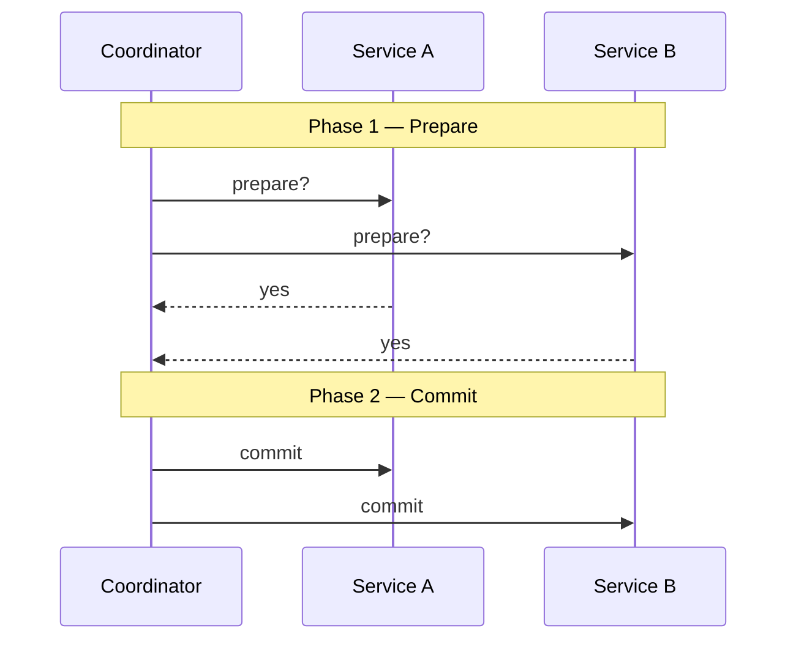

*Problems:* blocking (participants hold locks while waiting), and the coordinator is a single point of failure. Rarely used across microservices.

**Saga:** break the transaction into a sequence of local transactions, each publishing an event that triggers the next. On failure, run **compensating transactions** to undo previous steps (e.g., refund the payment, release the inventory).

- **Choreography** — services react to each other's events; no central brain.
- **Orchestration** — a saga orchestrator explicitly tells each service what to do.

> Sagas give *eventual* consistency, not isolation — design compensations carefully.

**Source(s) and further reading**

- [Saga pattern — microservices.io](https://microservices.io/patterns/data/saga.html)
- [Two-phase commit protocol — Wikipedia](https://en.wikipedia.org/wiki/Two-phase_commit_protocol)
- [Life Beyond Distributed Transactions — Pat Helland](https://queue.acm.org/detail.cfm?id=3025012)

## Sharding & Partitioning

Sharding (horizontal partitioning) splits one big dataset across multiple database nodes; each shard holds a subset of rows and shares the same schema.

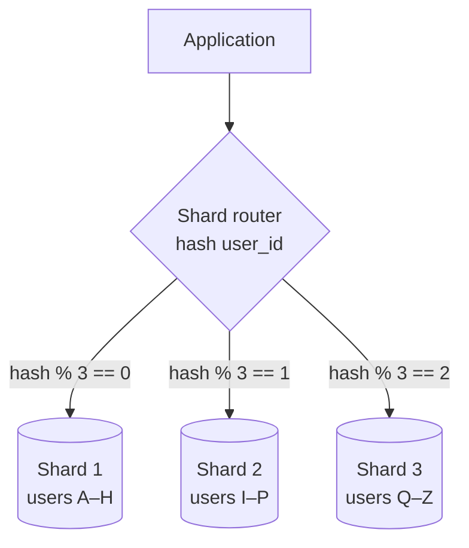

**Partitioning strategies:**
- **Hash-based** — uniform distribution, but range queries scatter everywhere.
- **Range-based** — great for range scans, but risks hot shards (e.g., all new users land on the newest range).
- **Directory-based** — a lookup service maps keys to shards; flexible but adds a component.

**Benefits:** write throughput and storage scale horizontally; failures are isolated to a shard.

**Costs:** cross-shard joins and transactions are painful; rebalancing data when adding shards is hard (see consistent hashing); hotspots ("celebrity problem" — one shard holding a viral user melts down while others idle).

> Shard only after simpler levers — caching, read replicas, indexes, vertical scale — are exhausted.

**Source(s) and further reading**

- [How Sharding Works — Jeeyoung Kim](https://medium.com/@jeeyoungk/how-sharding-works-b4dec46b3f6)
- [Sharding — MongoDB manual](https://www.mongodb.com/docs/manual/sharding/)
- [Herding Elephants: Lessons from Sharding Postgres at Notion](https://www.notion.so/blog/sharding-postgres-at-notion)

## Consistent Hashing

With naive `hash(key) % N` sharding, changing `N` (adding/removing a node) remaps almost *every* key. Consistent hashing fixes this by placing both nodes and keys on a **hash ring**; each key belongs to the first node clockwise from it.

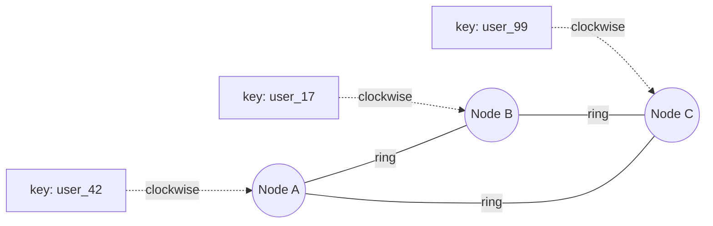

- Adding or removing a node only remaps the keys between it and its neighbor — roughly `1/N` of the data instead of all of it.
- **Virtual nodes:** each physical node appears at many points on the ring, smoothing out uneven distributions and letting stronger machines take more load.

**Used by:** DynamoDB, Cassandra, Redis Cluster (hash slots), CDNs, and distributed caches.

**Source(s) and further reading**

- [Consistent Hashing — Tom White](https://tom-e-white.com/2007/11/consistent-hashing.html)
- [Dynamo: Amazon's Highly Available Key-value Store — paper](https://www.allthingsdistributed.com/files/amazon-dynamo-sosp2007.pdf)
- [A Guide to Consistent Hashing — Toptal](https://www.toptal.com/big-data/consistent-hashing)

## Database Federation

Federation (functional partitioning) splits databases **by function** rather than by rows: a users DB, a products DB, an orders DB.

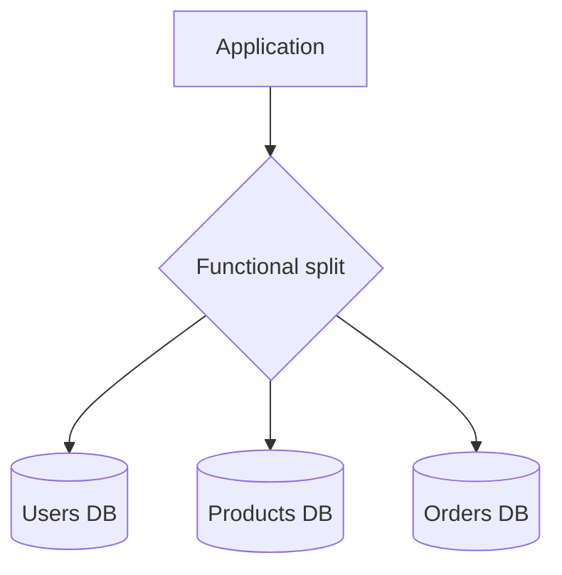

**Benefits:** smaller databases → more cache hits, more write parallelism, independent scaling per domain, clear ownership boundaries (a natural fit for microservices).

**Costs:** cross-database joins move into application code; more databases to operate; not helpful if one single table is what's huge (that's sharding's job).

**Source(s) and further reading**

- [Federation — The System Design Primer](https://github.com/donnemartin/system-design-primer#federation)
- [Scaling Up to Your First 10 Million Users — AWS re:Invent](https://www.youtube.com/watch?v=kKjm4ehYiMs)

## ID Generation Strategies

Auto-increment works until the database is replicated or sharded — then multiple nodes handing out "the next number" collide. The main strategies:

**Auto-increment (single DB)** — the database assigns 1, 2, 3… Simple, compact, time-ordered. But it ties ID generation to a single node (single point of failure, no scale-out) and publicly leaks business volume ("order #1042").

**UUID** — 128-bit identifiers generated anywhere with no coordination. Version 4 is random: collision-proof in practice, but large (36 chars as text), not time-sortable, and random inserts wreck B-tree index locality. UUIDv7 embeds a millisecond timestamp up front to restore sortability.

**Twitter Snowflake** — 64-bit IDs minted independently by each machine, laid out so IDs sort by creation time:

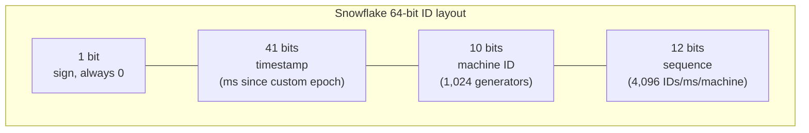

Timestamp-first means IDs sort chronologically — ideal for feeds and index locality. Machine IDs come from configuration or a coordinator (ZooKeeper); the sequence resets every millisecond. The classic failure mode is **clock skew**: generators must refuse to mint (or wait) if the clock moves backward, and 4,096/ms is the per-machine throughput ceiling before waiting for the next millisecond.

**Database ticket servers (Flickr)** — a dedicated MySQL server whose only job is issuing incrementing IDs via `REPLACE INTO`. Run two (one issuing odd, one even) for redundancy. Centralized and simple, but an extra dependency to operate and only roughly time-ordered across the pair.

| Strategy | Time-ordered | Coordination | Size | Weak spot |
|---|---|---|---|---|
| Auto-increment | Yes | Single DB | 8 B | Doesn't scale out; predictable |
| UUID v4 | No | None | 16 B | Size, index locality |
| UUID v7 | Yes (ms) | None | 16 B | Size; newer, less tooling |
| Snowflake | Yes (ms) | Machine ID assignment | 8 B | Clock skew handling |
| Ticket server | Roughly | Central server(s) | 8 B | Another service to keep alive |

**Source(s) and further reading**

- [Announcing Snowflake — Twitter Engineering](https://blog.twitter.com/engineering/en_us/a/2010/announcing-snowflake)
- [Sharding & IDs at Instagram](https://instagram-engineering.com/sharding-ids-at-instagram-1cf5a71e5a5c)
- [Ticket Servers: Distributed Unique Primary Keys on the Cheap — Flickr](https://code.flickr.net/2010/02/08/ticket-servers-distributed-unique-primary-keys-on-the-cheap/)
- [RFC 9562 — Universally Unique IDentifiers (UUIDs)](https://datatracker.ietf.org/doc/html/rfc9562)

---

# Chapter VI — Architecture Patterns

## N-tier Architecture

An N-tier architecture separates an application into physical layers — most commonly three: **presentation** (UI), **business logic** (application), and **data** (database). Each tier only talks to its neighbors (closed layers), can scale independently, and hides its internals behind an interface.

**Trade-off:** clean separation and independent scaling versus extra network hops and deployment complexity. Most web systems are at least 3-tier without anyone calling them that.

**Source(s) and further reading**

- [N-tier architecture style — Microsoft Azure Architecture Center](https://learn.microsoft.com/en-us/azure/architecture/guide/architecture-styles/n-tier)
- [Multitier architecture — Wikipedia](https://en.wikipedia.org/wiki/Multitier_architecture)

## Monoliths vs Microservices

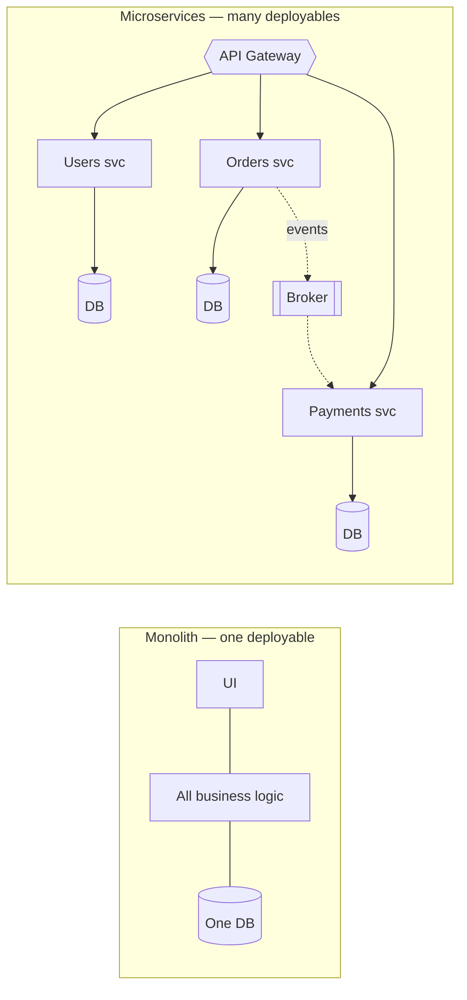

**Monolith** — one codebase, one deployment.
*Pros:* simple to develop, test, deploy, and debug; no network calls between modules; easy transactions.
*Cons:* everything scales together; one bad module can take down all of it; large teams step on each other; technology is locked in.

**Microservices** — small, autonomous services, each owning its data and communicating over the network.
*Pros:* independent deployment and scaling, team autonomy, fault isolation, per-service technology choices.
*Cons:* distributed-systems complexity everywhere — network failures, eventual consistency, observability, testing across services, operational overhead.

> **Distributed monolith warning:** microservices that must be deployed together, share a database, or synchronously chain calls give you the *costs* of microservices with the *benefits* of none. When in doubt, start with a well-modularized monolith and extract services when team size or scaling actually demands it.

**Source(s) and further reading**

- [Microservices — Martin Fowler & James Lewis](https://martinfowler.com/articles/microservices.html)
- [MonolithFirst — Martin Fowler](https://martinfowler.com/bliki/MonolithFirst.html)
- [Microservice architecture pattern catalog — microservices.io](https://microservices.io/patterns/index.html)

## Service Discovery

In a dynamic environment (autoscaling, containers), service instances appear and disappear constantly — hardcoded addresses can't work. Service discovery tracks who is alive and where.

- **Client-side discovery** — clients query a **service registry** (Consul, etcd, Eureka, ZooKeeper) and pick an instance themselves.
- **Server-side discovery** — clients call a load balancer / router which consults the registry (e.g., Kubernetes Services + DNS).
- Instances **register** on startup (or a third party registers them) and are removed when **health checks** fail.

**Service mesh** (Istio, Linkerd): moves discovery, retries, mTLS, and observability into sidecar proxies next to each service, out of application code.

**Source(s) and further reading**

- [Service registry pattern — microservices.io](https://microservices.io/patterns/service-registry.html)
- [Services — Kubernetes docs](https://kubernetes.io/docs/concepts/services-networking/service/)
- [Service discovery — HashiCorp Consul docs](https://developer.hashicorp.com/consul/docs/concepts/service-discovery)

## Asynchronism: Message Queues & Task Queues

Doing slow work inline makes users wait. Asynchronism moves that work out of the request path: acknowledge immediately, process in the background.

- **Message queues** deliver messages from producers to consumers, holding them until processed (email sending, webhooks, image processing).
- **Task queues** (Celery, Sidekiq, BullMQ) build on this for jobs with results and schedules.
- **Back pressure:** when the queue grows faster than workers drain it, limit the queue size and push back (reject or retry-later) — otherwise latency degrades unbounded and the system falls over. Failing fast beats melting slowly.

**Source(s) and further reading**

- [Queues Don't Fix Overload — Fred Hebert](https://ferd.ca/queues-don-t-fix-overload.html)
- [RabbitMQ tutorials](https://www.rabbitmq.com/tutorials)
- [Asynchronism — The System Design Primer](https://github.com/donnemartin/system-design-primer#asynchronism)

## Message Brokers: Queues vs Publish-Subscribe

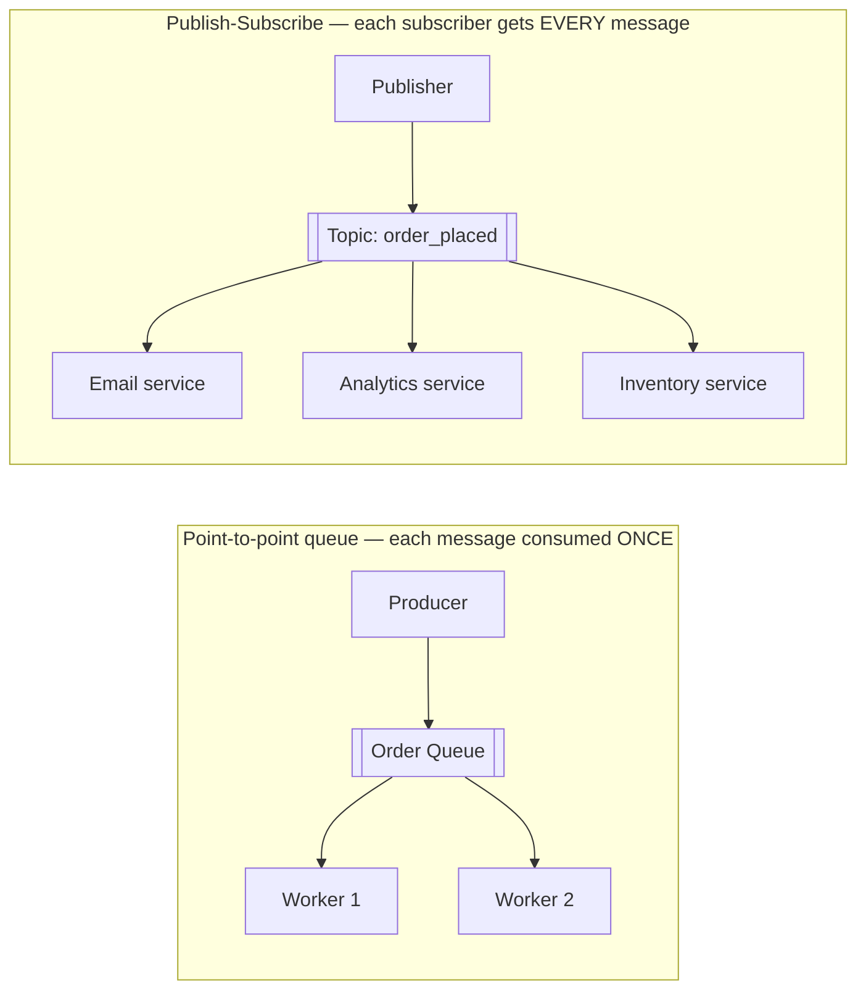

**Point-to-point queue:** competing consumers; each message is processed by exactly one worker. Perfect for distributing work.

**Publish-subscribe:** every subscriber receives every message on the topic. Perfect for broadcasting events to independent consumers.

**Why brokers at all:** they decouple producers from consumers (neither needs the other online), absorb traffic spikes (buffering), enable retries and dead-letter queues, and provide delivery guarantees (at-most-once, at-least-once, exactly-once — at-least-once plus **idempotent consumers** is the pragmatic standard).

**Examples:** RabbitMQ, Apache Kafka, Amazon SQS/SNS, NATS, Google Pub/Sub. (An **ESB** — enterprise service bus — is the heavyweight ancestor of this idea: a smart centralized bus doing routing and transformation. Modern designs prefer "smart endpoints, dumb pipes.")

**Source(s) and further reading**

- [Apache Kafka documentation](https://kafka.apache.org/documentation/)
- [What is a Message Queue? — AWS](https://aws.amazon.com/message-queue/)
- [Smart endpoints and dumb pipes — Martin Fowler](https://martinfowler.com/articles/microservices.html#SmartEndpointsAndDumbPipes)

## Message Queue Guarantees

What happens to a message when the consumer crashes halfway through processing it? Every broker answers with one of three delivery guarantees:

- **At-most-once** — fire and forget: the broker delivers once and never retries. Messages can be *lost* but never duplicated. Cheapest; fine for metrics and logs, where a gap is cheaper than the bookkeeping.
- **At-least-once** — the consumer acknowledges only *after* processing; unacknowledged messages are redelivered. Nothing is lost, but a crash between "processed" and "acked" produces *duplicates*.
- **Exactly-once** — every message affects state exactly once. True exactly-once *delivery* is impossible over an unreliable network (the Two Generals problem); systems that advertise it (e.g., Kafka transactions) actually implement exactly-once *processing* inside their own boundary using idempotence and transactional commits.

| Guarantee | Can lose messages | Can duplicate | Cost |
|---|---|---|---|
| At-most-once | Yes | No | Cheapest, fastest |
| At-least-once | No | Yes | Ack tracking, redelivery logic |
| Exactly-once | No | No (within one system) | Transactions/dedup state; slowest, most complex |

**The pragmatic default: at-least-once delivery + idempotent consumers.** Instead of chasing exactly-once through the whole pipeline, make processing safe to repeat — deduplicate on a message ID, use upserts, or make the operation naturally idempotent (`SET balance = 120`, not `ADD 20`). Then duplicates are harmless and the hard problem disappears.

```mermaid
sequenceDiagram
    participant B as Broker
    participant C as Consumer
    B->>C: deliver message id=42
    C->>C: process (idempotent)
    Note over C: crashes before sending ack
    B->>C: redeliver message id=42
    C->>C: id=42 already processed — skip side effects
    C-->>B: ack
    Note over B,C: At-least-once delivery, exactly-once effect
```

**Source(s) and further reading**

- [You Cannot Have Exactly-Once Delivery — Tyler Treat](https://bravenewgeek.com/you-cannot-have-exactly-once-delivery/)
- [Exactly-Once Semantics in Apache Kafka — Confluent](https://www.confluent.io/blog/exactly-once-semantics-are-possible-heres-how-apache-kafka-does-it/)
- [Message delivery guarantees — Kafka docs](https://kafka.apache.org/documentation/#semantics)

## Event-Driven Architecture (EDA)

Instead of services *calling* each other, services *emit events* (facts about things that happened: `OrderPlaced`, `PaymentCaptured`) and other services react. Components know about events, not about each other.

**Patterns:** simple pub/sub broadcasting, and **stream processing** (Kafka-style logs where consumers replay and process ordered event streams).

*Pros:* loose coupling, independent scaling, natural audit trail, easy to add new consumers without touching producers.
*Cons:* eventual consistency by default, harder end-to-end reasoning ("what happens when an order is placed?" is now scattered), duplicate delivery must be handled.

**Source(s) and further reading**

- [What do you mean by "Event-Driven"? — Martin Fowler](https://martinfowler.com/articles/201701-event-driven.html)
- [Event-Driven Architecture — AWS](https://aws.amazon.com/event-driven-architecture/)

## Event Sourcing

Rather than storing *current state* and overwriting it, store the **immutable sequence of events** that produced it. Current state is derived by replaying events (with periodic snapshots for speed).

```mermaid
flowchart LR
    E1[AccountOpened +0] --> E2[Deposited +100] --> E3[Withdrew −30] --> E4[Deposited +50]
    E4 --> S{{Replay → balance = 120}}
```

*Pros:* complete audit history for free, time-travel debugging, rebuild any read model from scratch, natural fit with EDA.
*Cons:* querying current state requires projections, event schema evolution is hard, and the mental model is unusual. Use where history *is* the business (ledgers, orders, compliance).

**Source(s) and further reading**

- [Event Sourcing — Martin Fowler](https://martinfowler.com/eaaDev/EventSourcing.html)
- [Event sourcing pattern — microservices.io](https://microservices.io/patterns/data/event-sourcing.html)

## CQRS

**Command Query Responsibility Segregation** splits the write model (commands) from the read model (queries), letting each be shaped and scaled for its job.

```mermaid
flowchart LR
    U([Client]) -->|commands: create, update| WM[Write model]
    WM --> WDB[(Write DB — normalized)]
    WDB -.sync / events.-> RDB[(Read DB — denormalized views)]
    U -->|queries| RM[Read model]
    RM --> RDB
```

Reads usually outnumber writes 100:1 — CQRS lets you run one write node and many denormalized read replicas, each shaped exactly like the screens they serve. Pairs naturally with event sourcing (events update the read projections).

*Cost:* two models to maintain and an eventual-consistency gap between write and read sides. Don't reach for it until the simple CRUD model actually hurts.

**Source(s) and further reading**

- [CQRS — Martin Fowler](https://martinfowler.com/bliki/CQRS.html)
- [CQRS pattern — Microsoft Azure Architecture Center](https://learn.microsoft.com/en-us/azure/architecture/patterns/cqrs)
- [CQRS Documents — Greg Young](https://cqrs.files.wordpress.com/2010/11/cqrs_documents.pdf)

---

# Chapter VII — Communication & APIs

## REST vs GraphQL vs gRPC

| | REST | GraphQL | gRPC |
|---|---|---|---|
| Style | Resources + HTTP verbs | Single endpoint, typed query language | RPC — call remote functions |
| Payload | JSON (usually) | JSON, client picks fields | Protobuf (binary) |
| Contract | Loose (OpenAPI optional) | Strong schema | Strong (.proto files) |
| Transport | HTTP/1.1+ | HTTP | HTTP/2 (multiplexed, streaming) |
| Caching | Native HTTP caching | Hard (POST to one endpoint) | Custom |
| Killer feature | Simplicity, ubiquity | No over/under-fetching; frontend agility | Speed + bidirectional streaming |
| Weakness | Over-fetching, N+1 round trips | Complexity, caching, rate-limit design | Browser support, human-readability |

**Practical guidance:** public APIs → REST; flexible client-driven UIs aggregating many resources → GraphQL; internal service-to-service calls where latency matters → gRPC. Mixing them (gRPC inside, REST/GraphQL at the edge via the API gateway) is standard.

**Source(s) and further reading**

- [Architectural Styles and the Design of Network-based Software Architectures — Roy Fielding's dissertation](https://www.ics.uci.edu/~fielding/pubs/dissertation/rest_arch_style.htm)
- [Introduction to GraphQL](https://graphql.org/learn/)
- [gRPC documentation](https://grpc.io/docs/)

## Remote Procedure Call (RPC)

RPC makes calling a function on a remote server look like calling a local function: the client calls a generated **stub**, which marshals the arguments, ships them over the network, and unmarshals the result — hiding sockets and serialization behind an ordinary function signature.

```mermaid
sequenceDiagram
    participant C as Client code
    participant CS as Client stub
    participant SS as Server stub
    participant S as Server implementation
    C->>CS: getUser(42) — looks like a local call
    CS->>SS: marshal args, send over network
    SS->>S: unmarshal, invoke getUser(42)
    S-->>SS: User object
    SS-->>CS: marshal result, send back
    CS-->>C: User object
```

**Popular frameworks:**

- **gRPC** (Google) — Protocol Buffers over HTTP/2; streaming in both directions; code generation for a dozen languages. The current default choice.
- **Apache Thrift** (Facebook) — interface definition language + binary protocol; mature multi-language support.
- **JSON-RPC** — a minimal spec (`method`, `params`, `id`) over any transport; human-readable and trivially simple, no schema or streaming.

**RPC vs REST:**

| | RPC | REST |
|---|---|---|
| Model | Actions — call named procedures (verbs) | Resources — manipulate nouns with HTTP verbs |
| Contract | Strict IDL (.proto/.thrift), generated clients | Loose; OpenAPI optional |
| Payload | Usually binary (Protobuf/Thrift) | Usually JSON |
| Performance | Higher — compact encoding, HTTP/2 multiplexing | Lower — text payloads, per-request overhead |
| Caching & tooling | Custom; poor browser support | HTTP-native caching, curl-able, ubiquitous |
| Coupling | Tighter — clients regenerate on contract change | Looser — uniform interface |

**When to use which:** RPC shines for **internal service-to-service** calls where you control both ends and want type safety and low latency; REST wins at **public edges** where ubiquity, cacheability, and human-debuggability matter. One caution: RPC hides the network, but the network never stops being unreliable — timeouts, retries, and circuit breakers still apply to every "local-looking" call.

**Source(s) and further reading**

- [Introduction to gRPC](https://grpc.io/docs/what-is-grpc/introduction/)
- [Remote procedure call — Wikipedia](https://en.wikipedia.org/wiki/Remote_procedure_call)
- [Apache Thrift](https://thrift.apache.org/)
- [JSON-RPC 2.0 specification](https://www.jsonrpc.org/specification)

## Long Polling vs WebSockets vs Server-Sent Events

Plain HTTP is client-initiated request/response. When the *server* has news (chat, notifications, live scores), you need one of these:

```mermaid
sequenceDiagram
    participant C as Client
    participant S as Server
    Note over C,S: Long polling — request held open until data exists
    C->>S: GET /updates
    S-->>C: (waits… then responds with data)
    C->>S: GET /updates (immediately reconnects)

    Note over C,S: WebSocket — persistent full-duplex channel
    C->>S: HTTP Upgrade handshake
    S-->>C: 101 Switching Protocols
    C-)S: message
    S-)C: message (either side, any time)

    Note over C,S: Server-Sent Events — one-way server → client stream
    C->>S: GET /stream (EventSource)
    S-->>C: event: score-update
    S-->>C: event: score-update …
```

- **Long polling** — works everywhere, but each message costs a full HTTP round trip and servers hold many idle connections. A stopgap.
- **WebSockets** — full-duplex, low latency, both directions. The choice for chat, multiplayer games, collaborative editing.
- **SSE** — simple one-way stream over plain HTTP with automatic reconnection. Ideal for feeds, tickers, notifications when the client rarely talks back.

**Source(s) and further reading**

- [WebSockets API — MDN](https://developer.mozilla.org/en-US/docs/Web/API/WebSockets_API)
- [Server-sent events — MDN](https://developer.mozilla.org/en-US/docs/Web/API/Server-sent_events)
- [Long polling — Ably](https://ably.com/topic/long-polling)

---

# Chapter VIII — Reliability & Operations

## Circuit Breaker

When a downstream service is failing, endlessly retrying makes things worse — threads pile up waiting on timeouts and the failure **cascades**. A circuit breaker wraps calls and fails fast when the target is unhealthy.

```mermaid
stateDiagram-v2
    [*] --> Closed
    Closed --> Open: failures exceed threshold
    Open --> HalfOpen: after cooldown timer
    HalfOpen --> Closed: trial request succeeds
    HalfOpen --> Open: trial request fails

    note right of Closed: Requests flow normally, failures are counted
    note right of Open: Requests rejected instantly with a fallback
    note right of HalfOpen: A few trial requests probe for recovery
```

- **Closed** — normal operation; failures increment a counter.
- **Open** — threshold exceeded; calls fail immediately with a fallback (cached data, default value, graceful error) instead of waiting on timeouts.
- **Half-open** — after a cooldown, a few probes test recovery; success closes the circuit again.

**Libraries/infra:** Resilience4j, Polly, Envoy/Istio outlier detection. Pair with timeouts, bounded retries with exponential backoff + jitter, and bulkheads.

**Source(s) and further reading**

- [CircuitBreaker — Martin Fowler](https://martinfowler.com/bliki/CircuitBreaker.html)
- [CircuitBreaker — Resilience4j docs](https://resilience4j.readme.io/docs/circuitbreaker)
- [Timeouts, Retries, and Backoff with Jitter — AWS Builders' Library](https://aws.amazon.com/builders-library/timeouts-retries-and-backoff-with-jitter/)

## Rate Limiting

Rate limiting caps how many requests a client may make in a window — protecting against abuse, brute force, scraping, cascading overload, and runaway costs.

**Algorithms:**

| Algorithm | Idea | Notes |
|---|---|---|
| Token bucket | Bucket refills at rate R; each request takes a token | Allows short bursts; the most common |
| Leaky bucket | Requests drain at a fixed rate; overflow is dropped | Smooths traffic to constant rate |
| Fixed window | Counter per time window | Simple; bursts at window edges (2× spikes) |
| Sliding log | Timestamp every request | Exact but memory-heavy |
| Sliding window counter | Weighted blend of adjacent windows | Good accuracy/cost balance |

**Distributed rate limiting** needs shared state (typically Redis) and must weigh race conditions vs the latency of locking. Return `429 Too Many Requests` with a `Retry-After` header.

**Source(s) and further reading**

- [What is rate limiting? — Cloudflare Learning Center](https://www.cloudflare.com/learning/bots/what-is-rate-limiting/)
- [Scaling your API with rate limiters — Stripe](https://stripe.com/blog/rate-limiters)
- [Counting things, a lot of different things — Cloudflare](https://blog.cloudflare.com/counting-things-a-lot-of-different-things/)

## SLA, SLO, SLI

- **SLI** (indicator) — the *measurement*: "p99 latency was 187 ms", "99.95% of requests succeeded."
- **SLO** (objective) — the internal *target*: "99.9% of requests succeed over 30 days."
- **SLA** (agreement) — the external *contract* with consequences: "99.9% uptime or you get service credits."

> SLA is the promise, SLO is the goal that protects the promise, SLI is the measurement that tells you where you stand. The gap between SLO and 100% is your **error budget** — spend it on shipping features; when it's exhausted, spend engineering time on reliability.

**Source(s) and further reading**

- [Service Level Objectives — Google SRE Book](https://sre.google/sre-book/service-level-objectives/)
- [SLA vs SLO vs SLI — Atlassian](https://www.atlassian.com/incident-management/kpis/sla-vs-slo-vs-sli)

## Disaster Recovery

Disaster recovery (DR) is the plan for surviving events that take out entire systems or regions.

Two numbers define every DR plan:

- **RTO (Recovery Time Objective)** — how long until service is restored?
- **RPO (Recovery Point Objective)** — how much data (measured in time) can you afford to lose?

**Strategies, cheapest to fastest:**
1. **Backup & restore** — RTO hours, RPO hours. Just backups in another region.
2. **Pilot light** — core data replicated; minimal infra idles until scaled up in a disaster.
3. **Warm standby** — a scaled-down full copy runs continuously; scale it up to fail over.
4. **Multi-site active-active** — full capacity in multiple regions; RTO ~zero, cost ~double.

> Untested DR is fiction: run game days and actually fail over.

**Source(s) and further reading**

- [Disaster recovery options in the cloud — AWS whitepaper](https://docs.aws.amazon.com/whitepapers/latest/disaster-recovery-workloads-on-aws/disaster-recovery-options-in-the-cloud.html)
- [Disaster recovery planning guide — Google Cloud](https://cloud.google.com/architecture/dr-scenarios-planning-guide)

## Virtual Machines & Containers

**VM** — a hypervisor slices one physical machine into several virtual ones, each with its own full OS. Strong isolation; heavyweight (GBs, minutes to boot).

**Container** — packages the app with its dependencies but **shares the host OS kernel**. Lightweight (MBs, milliseconds to start), identical across dev/staging/prod.

| | VM | Container |
|---|---|---|
| Isolation | Hardware-level (own kernel) | Process-level (shared kernel) |
| Size / start time | GBs / minutes | MBs / ms–seconds |
| Density per host | Low | High |
| Typical use | Strong isolation, legacy OS, multi-tenant | Microservices, CI/CD, autoscaling |

**Orchestration:** at scale, Kubernetes schedules containers across a cluster, restarts failures, autoscales, and handles service discovery and rolling deploys. VMs and containers compose: cloud providers run your containers *inside* VMs.

**Source(s) and further reading**

- [What is a container? — Docker](https://www.docker.com/resources/what-container/)
- [Containers vs VMs — Red Hat](https://www.redhat.com/en/topics/containers/containers-vs-vms)
- [Kubernetes overview](https://kubernetes.io/docs/concepts/overview/)

---

# Chapter IX — Security

## OAuth 2.0 & OpenID Connect

**OAuth 2.0** is a framework for **delegated authorization**: a user grants an application limited access to their resources on another service, without sharing their password.

Roles: **Resource owner** (the user) · **Client** (the app wanting access) · **Authorization server** (issues tokens) · **Resource server** (holds the data).

```mermaid
sequenceDiagram
    participant U as User (Resource Owner)
    participant App as Client App
    participant Auth as Authorization Server
    participant API as Resource Server

    U->>App: "Sign in with Google"
    App->>Auth: redirect: authorization request
    U->>Auth: log in + consent
    Auth-->>App: authorization code (via redirect)
    App->>Auth: code + client secret
    Auth-->>App: access token (+ refresh token, + ID token if OIDC)
    App->>API: request with access token
    API-->>App: protected resource
```

**OpenID Connect (OIDC)** is a thin identity layer on top of OAuth 2.0: it adds an **ID token** (a signed JWT with user identity claims), turning "delegated authorization" into "login with X." OAuth answers *what can this app do*; OIDC answers *who is this user*.

**Source(s) and further reading**

- [OAuth 2.0 — oauth.net](https://oauth.net/2/)
- [An Illustrated Guide to OAuth and OpenID Connect — Okta](https://developer.okta.com/blog/2019/10/21/illustrated-guide-to-oauth-and-oidc)
- [How OpenID Connect Works — OpenID Foundation](https://openid.net/developers/how-connect-works/)

## Single Sign-On (SSO)

SSO lets a user authenticate once with a central **Identity Provider (IdP)** — Okta, Azure AD, Google Workspace — and access many independent applications (**Service Providers**) without logging in again.

Flow (SAML or OIDC): the app redirects an unauthenticated user to the IdP → the IdP authenticates (or already has a session) → it returns a signed assertion/token → the app trusts it and creates its own session.

*Pros:* one strong credential + MFA in one place, central offboarding, less password fatigue.
*Cons:* the IdP is a single point of failure and a high-value target — its availability and security are paramount.

**Source(s) and further reading**

- [What is SSO? — Cloudflare Learning Center](https://www.cloudflare.com/learning/access-management/what-is-sso/)
- [Single Sign-On — Auth0 docs](https://auth0.com/docs/authenticate/single-sign-on)

## SSL, TLS, mTLS

- **SSL** — the original encryption protocol; all versions are deprecated. The word survives colloquially ("SSL certificate").
- **TLS** — SSL's successor and today's standard (TLS 1.2/1.3). Provides **encryption** (nobody can read traffic), **authentication** (certificates prove the server's identity via a chain of trust to a CA), and **integrity** (tampering is detected). HTTPS = HTTP over TLS. The handshake uses asymmetric crypto to agree on symmetric session keys.
- **mTLS (mutual TLS)** — *both* sides present certificates, so client and server each verify the other. Standard for **service-to-service** traffic in zero-trust networks and service meshes (Istio/Linkerd issue and rotate the certs automatically).

**Source(s) and further reading**

- [What is TLS? — Cloudflare Learning Center](https://www.cloudflare.com/learning/ssl/transport-layer-security-tls/)
- [What is mTLS? — Cloudflare Learning Center](https://www.cloudflare.com/learning/access-management/what-is-mutual-tls/)
- [RFC 8446 — TLS 1.3](https://datatracker.ietf.org/doc/html/rfc8446)

---

# Chapter X — Interview Preparation

## How to Approach a System Design Interview

A system design interview is an open-ended conversation, not a quiz. Drive it with a four-step framework (~45 minutes):

```mermaid
flowchart LR
    S1["1 · Requirements &<br/>constraints<br/>(~5 min)"] --> S2["2 · High-level<br/>design<br/>(~10 min)"] --> S3["3 · Core<br/>components<br/>(~15 min)"] --> S4["4 · Scale the<br/>design<br/>(~10 min)"]
```

**Step 1 — Outline use cases, constraints, and assumptions.** Ask questions before drawing anything: Who are the users? How many? Read-heavy or write-heavy? What's in scope and out of scope? Do the back-of-the-envelope math (below) *with* the interviewer.

**Step 2 — High-level design.** Sketch the main boxes: clients, load balancer, app servers, database, cache. Justify each. Don't gold-plate yet.

**Step 3 — Design core components.** Go deep where it matters for this problem: API contracts, data model/schema, the algorithm at the heart (e.g., how you'd generate a short URL), how components talk.

**Step 4 — Scale the design.** Find bottlenecks and fix them with the building blocks in this guide: cache, replicas, sharding, CDN, queues, autoscaling. Every fix is a trade-off — say what it costs.

**Source(s) and further reading**

- [How to approach a system design interview question — The System Design Primer](https://github.com/donnemartin/system-design-primer#how-to-approach-a-system-design-interview-question)
- [The System Design Interview — HiredInTech](https://www.hiredintech.com/system-design)
- [System Design Interview: An Insider's Guide — Alex Xu](https://www.amazon.com/System-Design-Interview-insiders-Second/dp/B08CMF2CQF)

## Back-of-the-Envelope Calculations

**Powers of two:**

| Power | Approx value | Shorthand |
|---|---|---|
| 2¹⁰ | thousand | 1 KB |
| 2²⁰ | million | 1 MB |
| 2³⁰ | billion | 1 GB |
| 2⁴⁰ | trillion | 1 TB |
| 2⁵⁰ | quadrillion | 1 PB |

**Latency numbers every programmer should know (Jeff Dean):**

| Operation | Time |
|---|---|
| L1 cache reference | 0.5 ns |
| Branch mispredict | 5 ns |
| L2 cache reference | 7 ns |
| Mutex lock/unlock | 100 ns |
| Main memory reference | 100 ns |
| Compress 1 KB with Zippy | 10 μs |
| Send 1 KB over 1 Gbps network | 10 μs |
| Read 4 KB randomly from SSD | 150 μs |
| Read 1 MB sequentially from memory | 250 μs |
| Round trip within same datacenter | 500 μs |
| Read 1 MB sequentially from SSD | 1 ms |
| Disk seek | 10 ms |
| Read 1 MB sequentially from disk | 30 ms |
| Send packet CA → Netherlands → CA | 150 ms |

Takeaways: memory is ~100× faster than SSD, which is ~10× faster than disk; a cross-ocean round trip costs ~150 ms, which is why CDNs exist; sequential beats random everywhere.

**Handy rules:** 1 day ≈ 86,400 s (round to 10⁵ for math). A machine handling 1,000 RPS is respectable. QPS math example: 100M writes/day ≈ 100M / 10⁵ ≈ **1,000 writes/sec** average, ~2–3× that at peak.

**Source(s) and further reading**

- [Latency Numbers Every Programmer Should Know — gist](https://gist.github.com/jboner/2841832)
- [Interactive latency numbers over time — Colin Scott](https://colin-scott.github.io/personal_website/research/interactive_latency.html)
- [Numbers Everyone Should Know — Jeff Dean, Stanford talk](https://static.googleusercontent.com/media/research.google.com/en//people/jeff/stanford-295-talk.pdf)

## Geohashing & Quadtrees

Location-based services ("find drivers near me") can't scan every coordinate. Two classic spatial indexes:

- **Geohashing** encodes latitude/longitude into a short base-32 string (`9q8yy`) by recursively halving the world. Longer strings = smaller cells, and **nearby places share prefixes** — so proximity search becomes a cheap string-prefix match. Caveat: neighbors can straddle cell boundaries, so check the 8 adjacent cells too.
- **Quadtrees** recursively split the map into four quadrants, subdividing any node that exceeds capacity (e.g., 100 points). Dense cities get fine cells, empty oceans stay coarse. Great for k-nearest-neighbor queries; used (conceptually) by Uber/Yelp-style services.

**Source(s) and further reading**

- [Geohash — Wikipedia](https://en.wikipedia.org/wiki/Geohash)
- [H3: Uber's Hexagonal Hierarchical Spatial Index](https://www.uber.com/blog/h3/)
- [Geospatial indexing — Redis docs](https://redis.io/docs/latest/develop/data-types/geospatial/)

## Design: URL Shortener [Easy]

Map long URLs to short base62 keys and redirect at high read volume — key generation and caching do the heavy lifting.

<details>
<summary>Full design walkthrough</summary>

**Requirements:** shorten a long URL; redirect on visit; 100M new URLs/month; read:write ≈ 100:1; links shouldn't guessably enumerate.

**Estimates:** writes ≈ 40/s, reads ≈ 4,000/s → read-heavy → cache aggressively. Storage: 100M × ~500 bytes × years ≈ single-digit TBs — sharding optional early on.

**Key generation:** encode an auto-incrementing ID (or pre-generated key range per server) in **base62** `[a-zA-Z0-9]` — 62⁷ ≈ 3.5 trillion 7-character keys. Avoid hashing the URL directly (collisions, same-URL duplicates need policy).

```mermaid
flowchart LR
    U([User]) --> LB{{Load Balancer}}
    LB --> API[Web / API servers]
    API -->|"write: create short URL"| KGS[Key Generation<br/>base62 counter]
    API --> C[(Cache — hot URLs)]
    C -->|miss| DB[(URL store<br/>short_key → long_url)]
    API -->|"read: GET /abc123"| C
    API -->|301/302 redirect| U
```

**Details worth mentioning:** 302 vs 301 redirects (302 lets you collect analytics), TTL/expiry cleanup as a lazy background job, rate limiting on creation, and analytics via an async queue so redirects stay fast.

**Source(s) and further reading**

- [Design Pastebin/Bit.ly — The System Design Primer](https://github.com/donnemartin/system-design-primer/blob/master/solutions/system_design/pastebin/README.md)
- [Base62 — Wikipedia](https://en.wikipedia.org/wiki/Base62)

</details>

## Design: WhatsApp [Medium]

Persistent WebSocket connections, a presence/session service for routing, and durable queues for offline delivery.

<details>
<summary>Full design walkthrough</summary>

**Core requirements:** 1-on-1 and group chat, sent/delivered/read receipts, last-seen, media sharing, offline delivery.

**Architecture spine:**
- **WebSockets** for every online client — a persistent duplex connection to a chat server.
- A **session/presence service** maps `user → chat-server connection` so messages can be routed.
- Messages flow client → chat server → (queue) → recipient's chat server → recipient; if the recipient is offline, messages **persist in a queue/DB** and deliver on reconnect.
- **Receipts** are just tiny system messages flowing the reverse way (sent = stored, delivered = pushed, read = client event).
- **Group chat:** a group service fans out each message to member connections (fan-out on write for small groups); very large groups fan out lazily.
- **Media:** upload to object storage (S3) via a separate service; send only the URL + metadata through the chat pipeline; CDN for downloads.
- Store chat history in a write-optimized wide-column store (e.g., Cassandra-style), sharded by chat/user ID.

```mermaid
sequenceDiagram
    participant A as Sender app
    participant S1 as Chat server 1
    participant SS as Session service
    participant S2 as Chat server 2
    participant B as Recipient app

    A->>S1: message (over WebSocket)
    S1-->>A: receipt: sent (persisted)
    S1->>SS: where is recipient connected?
    SS-->>S1: chat server 2
    S1->>S2: route message
    alt Recipient online
        S2->>B: push message
        B-->>S2: receipt: delivered
    else Recipient offline
        S2->>S2: park in offline queue, deliver on reconnect
    end
```

**Source(s) and further reading**

- [The WhatsApp Architecture Facebook Bought for $19 Billion — High Scalability](https://highscalability.com/the-whatsapp-architecture-facebook-bought-for-19-billion/)
- [1 million is so 2011 — WhatsApp blog](https://blog.whatsapp.com/1-million-is-so-2011)

</details>

## Design: Twitter [Medium]

Extremely read-heavy timelines solved with hybrid fan-out: push tweets to follower timelines on write, except for celebrities.

<details>
<summary>Full design walkthrough</summary>

**Core requirements:** post tweets, follow users, home timeline, likes, search; extremely read-heavy.

**The central problem — timeline generation:**
- **Fan-out on write (push):** when a user tweets, insert it into every follower's precomputed timeline (Redis lists). Reads are O(1) — but a celebrity with 100M followers = 100M writes per tweet ("hotkey" problem).
- **Fan-out on read (pull):** build the timeline at request time by merging recent tweets from everyone you follow. Cheap writes, expensive reads.
- **Hybrid (what real systems do):** push for normal users; *don't* fan out celebrities — merge their fresh tweets into timelines at read time.

**Other components:** tweets in a sharded store keyed by ID (snowflake IDs encode timestamp → chronological sort for free); social graph service (follower/following, heavily cached); search via an inverted index (Elasticsearch) fed asynchronously by a Kafka pipeline; media via object storage + CDN; trending via stream processing over the tweet firehose.

```mermaid
flowchart LR
    T([New tweet]) --> FS{Author follower count?}
    FS -->|normal user| FO[Fan-out worker]
    FO --> TL1[(Follower timeline caches<br/>Redis lists)]
    FS -->|celebrity| CS[(Celebrity tweet store)]
    R([Timeline request]) --> M[Merge service]
    TL1 --> M
    CS -->|pulled at read time| M
    M --> F[Rendered home timeline]
```

**Source(s) and further reading**

- [Timelines at Scale — Raffi Krikorian, InfoQ](https://www.infoq.com/presentations/Twitter-Timeline-Scalability/)
- [The Infrastructure Behind Twitter: Scale — Twitter Engineering](https://blog.twitter.com/engineering/en_us/topics/infrastructure/2017/the-infrastructure-behind-twitter-scale)

</details>

## Design: Netflix [Hard]

A transcoding pipeline feeding a push CDN embedded inside ISPs — browsing is microservices, but video bytes only ever flow edge to client.

<details>
<summary>Full design walkthrough</summary>

**Core requirements:** upload/ingest video, transcode, browse, and stream at massive scale; recommendations.

**Key ideas:**
- **Ingestion pipeline:** source video is chunked and **transcoded into many resolutions/codecs** (parallelized per chunk via a queue of transcoding workers), then packaged for adaptive streaming.
- **Adaptive bitrate streaming (HLS/DASH):** clients fetch small segments and switch quality per-segment based on measured bandwidth.
- **CDN is the product:** Netflix's Open Connect places cache appliances *inside ISPs*; ~95%+ of traffic never leaves the ISP. Popular titles are pushed to edges during off-peak hours (push CDN).
- **Control plane vs data plane:** browsing, auth, and recommendations run on a microservices control plane (heavy caching, EDA); actual video bytes flow only edge → client.
- **Recommendations:** offline ML pipelines over viewing telemetry (Kafka → data lake → batch/stream jobs) precompute personalized rows.

```mermaid
flowchart LR
    subgraph Ingest[Ingestion pipeline]
        SRC[Source video] --> CH[Chunker] --> TQ[[Transcode queue]] --> TW[Transcode workers<br/>many resolutions and codecs] --> PK[Packager<br/>HLS/DASH segments]
    end
    PK --> OC[Open Connect edge caches<br/>inside ISPs]
    subgraph Control[Control plane on AWS]
        API[Browse, auth, recommendations] --> ST[Steering service]
    end
    U([Client]) -->|browse, press play| API
    ST -->|URLs of nearby edge| U
    OC -->|video segments, adaptive bitrate| U
```

**Source(s) and further reading**

- [Netflix Open Connect](https://openconnect.netflix.com/)
- [Netflix: What Happens When You Press Play? — High Scalability](https://highscalability.com/netflix-what-happens-when-you-press-play/)
- [Netflix Tech Blog](https://netflixtechblog.com/)

</details>

## Design: Uber [Hard]

A write-heavy stream of driver GPS updates indexed by spatial cells, matched to riders by a ranking service, with trips as durable state machines.

<details>
<summary>Full design walkthrough</summary>

**Core requirements:** riders request rides; nearby drivers matched in seconds; live location tracking; trip pricing.

**Key ideas:**
- Drivers stream GPS updates every few seconds over persistent connections — an enormous **write-heavy** load handled by an in-memory location service, not a relational DB.
- **Spatial indexing:** the map is divided into cells ([geohash/quadtree/H3](#geohashing--quadtrees)); driver locations update their cell; "find nearby drivers" = query the rider's cell + neighbors.
- **Matching service:** ranks candidate drivers (ETA, rating), offers the ride, handles decline/timeout cascades.
- **Trip service:** a state machine (`requested → matched → arriving → in_progress → completed`) persisted durably, with events feeding pricing, receipts, and analytics.
- **Surge pricing:** stream processing computes supply/demand per cell in near real time.
- Location history to a wide-column store asynchronously for billing disputes and ML.

```mermaid
flowchart LR
    D([Drivers]) -->|GPS every few seconds| LS[Location service<br/>in-memory, cell index]
    R([Rider]) -->|request ride| MS[Matching service]
    MS -->|query rider cell + neighbors| LS
    LS -->|nearby candidates| MS
    MS -->|rank by ETA, offer ride| D
    MS --> TS[Trip service<br/>state machine]
    TS --> PR[Pricing and receipts]
    LS -.async.-> H[(Location history store)]
```

**Source(s) and further reading**

- [H3: Uber's Hexagonal Hierarchical Spatial Index](https://www.uber.com/blog/h3/)
- [Scaling Uber's Real-time Market Platform — InfoQ](https://www.infoq.com/presentations/uber-market-platform/)

</details>

---

## Design: Web Crawler [Medium]

Walk the web graph politely and without loops: a prioritized URL frontier, per-host rate limits, and dedupe at both content and URL level.

<details>
<summary>Full design walkthrough</summary>

**Requirements:** crawl 1B pages per month for a search index; respect `robots.txt` and per-site rate limits; never hammer one host; avoid crawler traps and duplicate content; support re-crawling for freshness; extensible processing (indexing, archiving).

**Estimates:** 1B pages/month ≈ 400 pages/sec sustained. At ~500 KB average page size that is ~200 MB/s of download bandwidth and ~500 TB of raw HTML per month before deduplication and compression — object storage territory from day one.

**Key ideas:**
- The **URL frontier** is the heart: a two-level queue system where *front* queues implement priority (page rank, update frequency) and *back* queues implement **politeness** (one queue per host, drained on a per-host timer so no server gets hammered).
- Fetcher workers pull from the frontier, check `robots.txt` (cached per host) and resolve DNS through a local cache — DNS lookup is a real bottleneck at 400 fetches/sec.
- **Content dedupe:** checksum or SimHash each page; near-duplicates (mirrors, boilerplate) are dropped before processing.
- **URL dedupe:** a Bloom filter answers "have I seen this URL?" in memory with a tolerable false-positive rate.
- **Trap avoidance:** cap URL length and per-domain page counts; detect calendar/faceted-navigation loops by depth limits.

```mermaid
flowchart LR
    S[Seed URLs] --> F[[URL Frontier<br/>priority + politeness queues]]
    F --> W[Fetcher workers<br/>robots.txt + DNS cache]
    W --> D{Content seen?<br/>checksum / SimHash}
    D -->|duplicate| X[Drop]
    D -->|new| ST[(Content store)]
    D -->|new| E[Link extractor] --> UF[URL filter] --> U{URL seen?<br/>Bloom filter}
    U -->|new| F
```

**Details worth mentioning:** distribute the frontier by hashing on *hostname* so one worker owns a host's politeness timer; checkpoint frontier state for crash recovery; separate the fetch pipeline from the processing pipeline with a queue so indexing lag never slows crawling; re-crawl frequency proportional to observed change rate of each page.

**Source(s) and further reading**

- [Design a web crawler — The System Design Primer](https://github.com/donnemartin/system-design-primer/blob/master/solutions/system_design/web_crawler/README.md)
- [RFC 9309 — Robots Exclusion Protocol](https://www.rfc-editor.org/rfc/rfc9309.html)
- [Common Crawl — an open web crawl corpus](https://commoncrawl.org/)

</details>

## Design: Rate Limiter [Easy]

A gateway middleware that answers one question per request — "does this client have budget left?" — using atomic counters in Redis.

<details>
<summary>Full design walkthrough</summary>

**Requirements:** enforce rules like "100 requests/minute per API key"; add under ~2 ms of latency; work across many gateway nodes (distributed); return `429` with useful headers; tolerate the limiter's own store failing.

**Estimates:** at 10,000 RPS each request costs one Redis round trip (sub-millisecond in-datacenter, ~100k ops/s per instance) — one Redis node with pipelining covers it; counters are a few bytes per active key, so even millions of clients fit in memory easily.

**Key ideas:**
- Pick an algorithm from [Rate Limiting](#rate-limiting): **token bucket** is the usual default (allows small bursts, simple to reason about); sliding-window counter when smoothness matters.
- Counters live in **Redis**; check-and-decrement runs as a **Lua script** so it is atomic — no race between "read count" and "increment".
- Rules ("100/min per user", "10/sec per IP for login") come from a config service, cached in each gateway node.
- Decide **fail-open vs fail-closed**: if Redis is unreachable, letting traffic through (fail-open) is usually right for product endpoints, fail-closed for auth endpoints.

```mermaid
flowchart LR
    C([Client]) --> GW[API gateway<br/>rate-limit middleware]
    GW --> RL{Budget left?<br/>Redis Lua: atomic<br/>check and decrement}
    RL -->|yes| S[Upstream service]
    RL -->|no| R[429 Too Many Requests<br/>+ Retry-After header]
    CFG[(Rules config)] -.cached.-> GW
```

**Details worth mentioning:** return `X-RateLimit-Limit` / `X-RateLimit-Remaining` / `Retry-After` headers; a local in-memory pre-filter can absorb hot keys before touching Redis; very large tenants may need their counter sharded (sum of shards) to avoid a hot key; log throttling decisions for abuse analysis.

**Source(s) and further reading**

- [Scaling your API with rate limiters — Stripe](https://stripe.com/blog/rate-limiters)
- [Rate limiting — Redis glossary](https://redis.io/glossary/rate-limiting/)

</details>

## Design: Notification System [Medium]

One service fanning out to push, SMS, and email through per-channel queues — with idempotency keys and dead-letter queues doing the reliability work.

<details>
<summary>Full design walkthrough</summary>

**Requirements:** three channels (mobile push, SMS, email); tens of millions of notifications/day; respect user preferences and opt-outs; no (or minimal) duplicates; retry on provider failure; templating; soft real-time — seconds of delay are acceptable.

**Estimates:** 10M/day is only ~115/sec average, but marketing blasts create 10–100x spikes — the design is entirely about absorbing spikes with queues, not raw throughput.

**Key ideas:**
- Producer services call one **notification service**, which validates, checks the **preference/opt-out store**, applies rate caps per user ("max 2 marketing pushes/day"), renders the template, and enqueues.
- **One queue per channel** so a slow SMS provider never delays push notifications; workers per channel talk to the providers (APNs/FCM, Twilio, SES).
- **Idempotency keys** on every notification: providers and workers may retry, and the key makes retries harmless.
- Failed sends retry with exponential backoff; poison messages land in a **dead-letter queue** for inspection instead of clogging the pipeline.
- A **device token registry** maps users to device tokens and prunes dead tokens from provider feedback (uninstalls).

```mermaid
flowchart LR
    P[Producer services] --> N[Notification service<br/>prefs, rate caps, dedupe, templates]
    N --> Q1[[Push queue]] --> W1[Push workers] --> A[APNs / FCM]
    N --> Q2[[SMS queue]] --> W2[SMS workers] --> B[Twilio]
    N --> Q3[[Email queue]] --> W3[Email workers] --> C[SES / SendGrid]
    W1 & W2 & W3 -.retries exhausted.-> DLQ[[Dead-letter queue]]
    A & B & C -.delivery receipts.-> T[(Tracking store)]
```

**Details worth mentioning:** opt-out handling is a legal requirement (CAN-SPAM, GDPR), not a feature; delivery/open tracking feeds analytics via an event stream; template versioning so in-flight notifications render correctly; priority lanes so an OTP code never queues behind a marketing blast.

**Source(s) and further reading**

- [Firebase Cloud Messaging docs](https://firebase.google.com/docs/cloud-messaging)
- [User Notifications (APNs) — Apple Developer](https://developer.apple.com/documentation/usernotifications)
- [Amazon SNS](https://aws.amazon.com/sns/)

</details>

## Design: Search Autocomplete [Medium]

Top-k completions for every keystroke in under 100 ms — an in-memory trie with precomputed suggestions, rebuilt offline from query logs.

<details>
<summary>Full design walkthrough</summary>

**Requirements:** return 5–10 ranked suggestions per keystroke; p99 latency under 100 ms; ranked by query popularity; suggestions refreshed daily (or streamed); handle thousands of QPS; prefix-based matching only (typo tolerance is a separate, harder problem).

**Estimates:** 10M daily users typing ~20 characters of queries each ≈ 2,300 QPS average, several times that at peak. Only popular queries need serving — the top ~100M distinct queries fit in memory when sharded.

**Key ideas:**
- A **trie** where each node stores its **precomputed top-k completions** — lookup cost is just walking the prefix, no subtree traversal at query time. Classic space-for-time trade.
- The serving trie is **read-only and in-memory**; queries never touch a database.
- A separate **offline pipeline** aggregates query logs (batch job or stream with a Count-Min Sketch for frequencies), builds a fresh trie, and **atomically swaps** it into the serving fleet.
- Shard the trie by prefix range when it outgrows one machine; cache the hottest prefixes (1–2 characters) at the edge/CDN.
- The browser debounces keystrokes so not every character costs a request.

```mermaid
flowchart LR
    U([Keystroke]) --> LB{{Load balancer}} --> A[Autocomplete nodes<br/>in-memory trie<br/>top-k per node]
    A -->|suggestions| U
    L[(Query logs)] --> AG[Aggregator<br/>daily batch or stream] --> TB[Trie builder]
    TB -.atomic swap of new trie.-> A
```

**Details worth mentioning:** normalize prefixes (lowercase, Unicode); filter offensive suggestions at build time; a personalization layer can re-rank the generic top-k per user; freshness vs cost — trending queries need the streaming path, evergreen ones are fine with daily builds.

**Source(s) and further reading**

- [Trie — Wikipedia](https://en.wikipedia.org/wiki/Trie)
- [Completion suggester — Elasticsearch docs](https://www.elastic.co/guide/en/elasticsearch/reference/current/search-suggesters.html)
- [How we built Prefixy: a scalable prefix search service](https://medium.com/@prefixyteam/how-we-built-prefixy-a-scalable-prefix-search-service-for-powering-autocomplete-c20f98e2eff1)

</details>

## Design: Unique ID Generator [Easy]

Mint 64-bit, time-sortable, globally unique IDs at tens of thousands per second with no single point of failure — Snowflake is the template.

<details>
<summary>Full design walkthrough</summary>

**Requirements:** IDs are unique, numeric, fit in 64 bits, roughly ordered by creation time, mintable at 10,000+/sec, and generation keeps working when any single node dies — no per-ID coordination.

**Key ideas:**
- The requirements eliminate the alternatives (see [ID Generation Strategies](#id-generation-strategies)): auto-increment is a single point of failure, UUIDv4 is 128 bits and unordered — a **Snowflake layout** (41-bit timestamp, 10-bit machine ID, 12-bit sequence) satisfies everything.
- Each generator node works alone: current timestamp + its machine ID + an in-memory sequence counter. No network calls per ID → microsecond latency, 4,096 IDs/ms/machine ceiling.
- **Machine IDs** are assigned once, via configuration or a coordination service (ZooKeeper/etcd) at startup.
- **Clock skew** is the classic failure: if the clock moves backward (NTP correction), refuse to mint or wait until the clock catches up — never emit a duplicate timestamp+sequence pair.
- The **custom epoch** matters: 41 bits of milliseconds ≈ 69 years from whenever you start counting.

```mermaid
flowchart LR
    subgraph G[Generator node - no coordination per ID]
        T[41-bit timestamp<br/>ms since custom epoch] --> ID[64-bit ID]
        M[10-bit machine ID<br/>assigned at startup] --> ID
        SQ[12-bit sequence<br/>resets every ms] --> ID
    end
    App[Services] -->|getId| G
    Z[(ZooKeeper / config)] -.machine ID lease.-> M
```

**Details worth mentioning:** embed-the-shard-key variants (Instagram packs a shard ID instead of a machine ID); UUIDv7 is the coordination-free 128-bit alternative when size doesn't matter; sequence exhaustion within a millisecond just waits ~1 ms; monitor NTP drift as an operational alarm.

**Source(s) and further reading**

- [Announcing Snowflake — Twitter Engineering](https://blog.twitter.com/engineering/en_us/a/2010/announcing-snowflake)
- [Sharding & IDs at Instagram](https://instagram-engineering.com/sharding-ids-at-instagram-1cf5a71e5a5c)

</details>

## Design Problems Quick Reference

| Design | Difficulty | Key concept |
|---|---|---|
| [URL Shortener](#design-url-shortener-easy) | Easy | Base62 key generation, read-heavy caching |
| [Unique ID Generator](#design-unique-id-generator-easy) | Easy | Snowflake bit layout, clock skew handling |
| [Rate Limiter](#design-rate-limiter-easy) | Easy | Token bucket, atomic counters in Redis |
| [WhatsApp](#design-whatsapp-medium) | Medium | WebSockets, session routing, offline queues |
| [Twitter](#design-twitter-medium) | Medium | Fan-out on write vs read, celebrity problem |
| [Notification System](#design-notification-system-medium) | Medium | Per-channel queues, idempotency, dead-letter queues |
| [Search Autocomplete](#design-search-autocomplete-medium) | Medium | Trie with precomputed top-k, offline rebuild |
| [Web Crawler](#design-web-crawler-medium) | Medium | URL frontier, politeness, Bloom-filter dedupe |
| [Netflix](#design-netflix-hard) | Hard | Transcoding pipeline, push CDN inside ISPs |
| [Uber](#design-uber-hard) | Hard | Spatial indexing, matching, trip state machines |

## Real-World Architectures

How three of the systems described above actually run in production.

### How Netflix Actually Works

The **control plane** (browsing, login, recommendations, "press play") runs as hundreds of microservices on AWS, fronted by the Zuul gateway, with EVCache (memcached) absorbing most reads and Cassandra as the durable store. The **data plane** is Open Connect: cache appliances physically installed inside ISP data centers. Every night, during off-peak hours, appliances **pre-load the titles predicted to be popular** in their region (push CDN). When a user presses play, a steering service returns URLs for the closest appliances holding that title, and video segments flow ISP-to-user without ever touching AWS — the vast majority of Netflix's traffic never crosses the public internet backbone.

```mermaid
flowchart LR
    U([Viewer]) -->|browse and play| CP[Control plane on AWS<br/>Zuul, microservices, EVCache, Cassandra]
    CP -->|URLs of nearest appliances| U
    F[Fill traffic<br/>nightly, off-peak] --> OCA[Open Connect appliances<br/>inside the viewer's ISP]
    OCA -->|video segments| U
```

**Source(s):** [Netflix Open Connect](https://openconnect.netflix.com/), [Netflix: What Happens When You Press Play? — High Scalability](https://highscalability.com/netflix-what-happens-when-you-press-play/)

### How Discord Handles Text and Voice at Scale

Each Discord server ("guild") is a **single Elixir process** on a gateway cluster holding millions of concurrent WebSockets — one process serializes all events for its guild, which makes fan-out simple and ordered. Message history originally lived in Cassandra; hot partitions ("celebrity" servers) caused pauses, so Discord moved to **ScyllaDB behind a Rust data service** that coalesces concurrent reads of the same data. Voice runs separately over WebRTC: clients send Opus audio to a **selective forwarding unit (SFU)** per voice channel, which forwards streams between participants without decoding them.

```mermaid
flowchart LR
    C([Clients]) -->|WebSockets| GW[Elixir gateways<br/>one process per guild]
    GW --> DS[Rust data service<br/>request coalescing]
    DS --> DB[(ScyllaDB<br/>message history)]
    C -->|Opus audio, WebRTC| SFU[Voice SFU<br/>per voice channel]
    SFU --> C
```

**Source(s):** [How Discord Stores Trillions of Messages](https://discord.com/blog/how-discord-stores-trillions-of-messages), [How Discord Handles Two and Half Million Concurrent Voice Users using WebRTC](https://discord.com/blog/how-discord-handles-two-and-half-million-concurrent-voice-users-using-webrtc), [How Discord Scaled Elixir to 5,000,000 Concurrent Users](https://discord.com/blog/how-discord-scaled-elixir-to-5-000-000-concurrent-users)

### How Uber Matches Riders and Drivers

Uber's dispatch system (DISCO) keeps **supply (drivers) and demand (riders) in memory**, sharded across a cluster coordinated by **Ringpop** (consistent hashing + gossip protocol, so nodes discover each other and share ownership of the keyspace without a central coordinator). The world is indexed with **H3**, Uber's hexagonal spatial grid — hexagons have more uniform neighbor distances than squares, which matters for supply-density math. Matching is not "closest driver wins": candidates from nearby cells are ranked by **ETA computed on the actual road graph**, and surge pricing is computed per cell from streaming supply/demand ratios.

```mermaid
flowchart LR
    D([Drivers]) -->|GPS stream| SUP[Supply service<br/>H3 cell index, in-memory]
    R([Rider request]) --> DEM[Demand service]
    DEM --> M[Match engine<br/>rank by road-graph ETA]
    SUP -->|candidates from nearby cells| M
    M -->|offer| D
    SUP & DEM -.per-cell ratios.-> SG[Surge pricing<br/>stream processing]
    subgraph Ring[Ringpop cluster - consistent hashing + gossip]
        SUP
        DEM
        M
    end
```

**Source(s):** [Scaling Uber's Real-time Market Platform — InfoQ](https://www.infoq.com/presentations/uber-market-platform/), [H3: Uber's Hexagonal Hierarchical Spatial Index](https://www.uber.com/blog/h3/), [Ringpop — Uber's application-layer sharding](https://github.com/uber/ringpop-node)

---

## References

These notes are a merged, rewritten study companion built from:

- **[The System Design Primer](https://github.com/donnemartin/system-design-primer)** — Donne Martin. The interview framework, trade-off first mindset (performance vs scalability, latency vs throughput, CAP), availability math, and back-of-the-envelope method come from here. Licensed CC BY 4.0.
- **[System Design Course](https://github.com/TuShArBhArDwA/System-Design)** — Tushar Bhardwaj / based on [Karan Pratap Singh's course](https://github.com/karanpratapsingh/system-design). The topic-by-topic curriculum (networking → load balancing → databases → architecture patterns → security → case studies) follows its structure.

**Going deeper:**
- *Designing Data-Intensive Applications* — Martin Kleppmann (the book on this subject)
- [High Scalability](http://highscalability.com/) — real-world architecture write-ups
- [AWS Architecture Center](https://aws.amazon.com/architecture/) / [Google Cloud Architecture Center](https://cloud.google.com/architecture)
- Engineering blogs: Netflix, Uber, Cloudflare, Discord, Stripe

> Diagrams are written in [Mermaid](https://mermaid.js.org/) so GitHub renders them natively — view this file on GitHub to see them drawn.

## Company Engineering Blogs

First-hand accounts of these patterns at production scale:

- [Netflix Tech Blog](https://netflixtechblog.com/)
- [Uber Engineering](https://www.uber.com/blog/engineering/)
- [Cloudflare Blog](https://blog.cloudflare.com/)
- [Discord Engineering](https://discord.com/category/engineering)
- [Stripe Engineering](https://stripe.com/blog/engineering)
- [AWS Architecture Blog](https://aws.amazon.com/blogs/architecture/)
- [Google Cloud Architecture Center](https://cloud.google.com/architecture)


